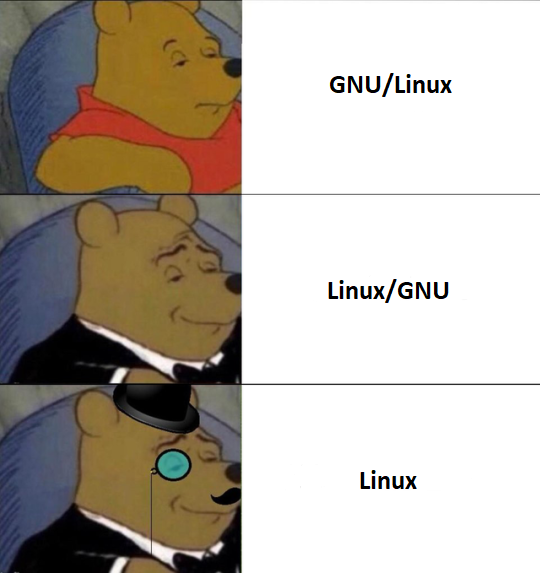

# Temat 0: Czym jest linux?

## Spis treści

Kliknij by rozwinąć

- [Temat 0: Czym jest linux?](#temat-0-czym-jest-linux)
  - [Spis treści](#spis-treści)
  - [Czym jest Linux?](#czym-jest-linux)
    - [Wracając do Linuxa](#wracając-do-linuxa)
    - [Jak to dokładnie działa?](#jak-to-dokładnie-działa)
    - [Linux czy GNU/Linux?](#linux-czy-gnulinux)
    - [Maskotka](#maskotka)
    - [Koniec wykładu z historii?](#koniec-wykładu-z-historii)
  - [Dlaczego używamy terminalu?](#dlaczego-używamy-terminalu)
  - [Dystrybucje linuxa](#dystrybucje-linuxa)

## Czym jest Linux?

Na początku był **UNIX**, czyli taki pradziadek systemów operacyjnych, z którego pochodzi **Linux**. Analogicznie do teorii Darwina, gdzie wszystkie gatunki wywodzą się od wspólnego przodka, tak **UNIX** jest przodkiem wszystkich systemów (no prawie, zawsze znajdą się wyjątki).

A tak na poważnie, w _Bell Labs_ w 1969 roku **Dennis Ritchie** i **Ken Thompson**, którzy są dość istotnymi postaciami w świecie programowania, stworzyli system **UNIX** (_tak naprawdę fundamenty systemu **UNIX** zostały stworzone przez Kena Thompsona w trzy tygodnie, ponieważ miał chwilę wolnego czasu, gdy jego żona wraz z córką wyjechały na wakacje_), który był oparty na języku **C** (którego **Ritchie** był głównym autorem). W latach 70. i 80. **UNIX** zyskał na popularności, a na tej popularności zaczęły powstawać nowe systemy operacyjne, takie jak **Linux** czy **macOS**.

O tym, jakie dokładnie cuda działy się w historii systemu UNIX, zostawmy na inną okazję, bo inaczej zaczniemy potrzebować narzędzi archeologicznych, żeby to ogarnąć lub książki - _Jak UNIX tworzył historię_ autorstwa **Briana W. Kernighana** (nie jest to reklama xD. Po prostu uważam, że jest to książka warta uwagi, jeśli interesuje kogoś historia systemu **UNIX**).

<i>Ken Thompson (z lewej) i Dennis Ritchie</i>

### Wracając do Linuxa

Przeskoczmy teraz do 17 września 1991 roku, kiedy to została udostępniona pierwsza wersja **jądra Linux** stworzona przez **Linusa Torvaldsa**.

**Torvalds** na pewnej grupie dyskusyjnej Miniksa napisał, że hobbystycznie tworzy nieduży system operacyjny - "_Tworzę (darmowy) system operacyjny (tylko hobby, nie będzie wielki i profesjonalny jak gnu)(...)_", i jak można się domyślić, była to nietrafna prognoza, bo w końcu **Linux** stał się jednym z najpopularniejszych systemów operacyjnych na świecie.

<i>Tryptyk "Linus Torvalds"</i>

> Czasami wystarczy chwila wolnego czasu i trochę pasji, by stworzyć coś wielkiego. Może dzięki temu i innym naszym kursom, właśnie **Ty** przy odrobinie wolnego czasu i pasji stworzysz coś wielkiego.

### Jak to dokładnie działa?

No dobrze, ale czym jest to **jądro Linuxa**? Jest to najbardziej podstawowa część systemu operacyjnego, która zarządza wszystkimi zadaniami realizowanymi przez system, ale samemu nie tworzy systemu operacyjnego. Do tego potrzeba kilku składników, **powłoki systemowej** czyli pośrednika pomiędzy systemem operacyjnym a... Tobą, użytkownikiem lub pomiędzy aplikacjami. Kolejnym elementem jest **kompilator**, który odpowiada za tłumaczenie naszego kodu na język maszynowy, czyli taki, który zrozumie nasz komputer. Na koniec potrzebna będzie nam jeszcze **biblioteka**, miejsce, gdzie przechowywane są podprogramy, z których korzystamy do pisania własnych programów. Wszystko to w przypadku **Linuxa** realizowane jest przez **GNU**, czyli kolejny uniksopodobny (_jest to akronim od "**GNU's not Unix**" - heh_) system oparty na wolnym oprogramowaniu (**Linux** też jest oparty na wolnym oprogramowaniu, oznacza to, tyle że każdy może nad nim pracować, ponieważ jego kod źródłowy jest udostępniony publicznie. Co to oznacza? Że każdy może pomóc w jego rozwijaniu, poprawiać błędy, udoskonalać bezpieczeństwo).

### Linux czy GNU/Linux?

Niektórzy fanatycy **Linuxa** mogliby stwierdzić, że całość powinna nazywać się **GNU/Linux** ze względu na to, że **GNU** bierze duży udział w Linuxie, inni z kolei powiedzą, że trafniejsza jest nazwa **Linux/GNU** ze względu na to, że to jądro systemu jest, uruchamiane jako pierwsze a prawda jest taka, że normalni śmiertelnicy jak my nazywają to **Linuxem** i tego się trzymajmy. Sama nazwa Linux to połączenie *Linus* i *UNIX* (_Jest jeszcze akronim tak samo, jak w przypadku GNU - **L**inux **I**s **N**ot **U**ni**X**_).

> Z ciekawostek dodam, że to nie **Linus Torvalds** wymyślił nazwę a **Ari Lemmke**, który był administratorem serwera, na którym **Torvalds** udostępnił publicznie kod źródłowy **jądra Linuxa**.

### Maskotka

Warto też wspomnieć o maskotce **Linuxa** czyli pingwinie o imieniu **Tux** (_nazwa najprawdopodobniej pochodzi od słów **T**orvald's **U**ni**X**_).

<i>Wizerunek Tux'a stworzył Larry Ewing w 1996 r. za pomocą programu GIMP.</i>

### Koniec wykładu z historii?

Czy coś z powyższego tekstu jest potrzebne, by pracować z Linuxem? Absolutnie nie. Dlaczego więc o tym pisze? Ponieważ historia systemu **UNIX** i **Linuxa** mnie interesuje i wydaje mi się, że niczego nie stracisz, czytając o niej. No może poza czasem XD, Ale jak mawia stare przysłowie:

>"Linux jest darmowym systemem operacyjnym pod warunkiem, że twój czas jest bezwartościowy."

Pomimo że nie zgadzam się z tym cytatem, bo odnosi się on do początkowych wersji Linuxa, to warto mieć na uwadze fakt, że na początku praca z Linuxem i terminalem może zająć trochę czasu.

Z nieoficjalnych źródeł wiem, że powyższy cytat wypowiedziała osoba, która nie przerabiała naszego kursu xD.

## Dlaczego używamy terminalu?

Zanim przejdziemy do pytania, dlaczego warto korzystać z **terminalu**, warto zdefiniować, czym on w ogóle jest.

> terminal – budynek lub zespół budynków będących wydzieloną częścią portu lotniczego, lub morskiego przeznaczoną do obsługi ruchu pasażerskiego i świadczącą usługi na rzecz pasażerów.

Pośmieszkowane, to teraz na poważnie, na systemie **Windows** korzystamy z graficznego interfejsu użytkownika (**GUI**), a w przypadku systemu **Linux** często sięga się po interfejs wiersza poleceń (**CLI**). Kiedy pracujemy zdalnie na serwerach, zawsze korzystamy z **wiersza poleceń**. Terminal to program, pozwalający nam na uruchomienie **wiersza poleceń** i interaktywną pracę z systemem operacyjnym. Z kolei **wiersz poleceń** to interaktywna konsola, dzięki której użytkownik może wprowadzać polecenia tekstowe i otrzymywać odpowiedzi od systemu operacyjnego. W przypadku **Linuxa** **wiersz poleceń** to podstawowe narzędzie do zarządzania całym systemem.

Jednak wśród użytkowników cieszy się on słabą opinią, ze względu na rozwój graficznych interfejsów użytkownika. Prawdę mówiąc, terminal może być na początku przytłaczający, ale po kilku godzinach pracy z nim docenisz jego zalety, gdy zorientujesz się, jak wiele rzeczy można dzięki niemu zrobić.

## Dystrybucje linuxa

Dystrybucje Linuxa to po prostu różne jego wersje. I na tym zdaniu można by poprzestać, ale rozwińmy myśl trochę dalej. Wszystkie dystrybucje korzystają z tego samego jądra, różnią się między sobą narzędziami i interfejsem użytkownika (GUI). **Ubuntu** (dystrybucja Linuxa, na której pracujemy w tym kursie) również ma GUI — powtarzam to z tego względu, że mogłem wcześniej zostać źle zrozumiany. My nie będziemy korzystać w tym kursie z interfejsu graficznego podczas pracy z Linuxem, co nie zmienia faktu, że go posiada.

Przykładowe dystrybucje linuxa:

- **Ubuntu** - jedna z najpopularniejszych i łatwych w użyciu dystrybucji opartych na Debianie. Jest przeznaczona głównie dla ~~użytkowników końcowych~~ zwykłych śmiertelników
- **Debian** - często jest wykorzystywany jako podstawa do innych dystrybucji Linuxa (jak pisałem wyżej)
- **Fedora** - głównie dla zaawansowanych użytkowników.

Nie będę zanudzał Ciebie i siebie opowiadaniem o dystrybucjach, ponieważ nie ma to większego sensu. My będziemy korzystać z **Ubuntu**.

---

| [Strona główna](https://github.com/BioSoft23/The_Curse_of_Linux) | [Następny Temat](https://github.com/AvirFrog/The_Curse_of_Linux) |
| :-------------------------------------------------------------: | :--------------------------------------------------------------- |

---
