# Temat 1: WSL

> Opracowane na podstawie https://learn.microsoft.com/en-us/windows/wsl/

## Spis treści

<details>
<summary>Kliknij by rozwinąć</summary>

- [Temat 1: WSL](#temat-1-wsl)
  - [Spis treści](#spis-treści)
  - [WSL, czyli Linux w Windowsie (tylko 10 oraz 11)](#wsl-czyli-linux-w-windowsie-tylko-10-oraz-11)
  - [Są dwa WSL](#są-dwa-wsl)
    - [Rzut oka na obie wersje WSL](#rzut-oka-na-obie-wersje-wsl)
      - [Integracja pomiędzy Windowsem a Linuxem](#integracja-pomiędzy-windowsem-a-linuxem)
      - [Małe obciążenie sprzętowe](#małe-obciążenie-sprzętowe)
      - [Pełny kernel Linuxa](#pełny-kernel-linuxa)
      - [Pełna kompatybilność wywołań systemowych](#pełna-kompatybilność-wywołań-systemowych)
      - [Operacje wejścia/wyjścia (ang. I/O - input/output)](#operacje-wejściawyjścia-ang-io---inputoutput)
      - [Wydajność między systemami plików](#wydajność-między-systemami-plików)
    - [Kiedy używać WSL1, a kiedy WSL2?](#kiedy-używać-wsl1-a-kiedy-wsl2)
    - [WSL2g - free DLC](#wsl2g---free-dlc)
  - [Instalacja WSL](#instalacja-wsl)
    - [Wymagania WSL](#wymagania-wsl)
    - [Najpierw to w ogóle trzeba mieć TERMINAL](#najpierw-to-w-ogóle-trzeba-mieć-terminal)
    - [Instalacja i logowanie](#instalacja-i-logowanie)
    - [Kurde, zapominałem hasła xD](#kurde-zapominałem-hasła-xd)
  - [Dostosowywanie Terminala](#dostosowywanie-terminala)
    - [Układ terminala](#układ-terminala)
      - [Powiększenie/zmniejszenie tekstu](#powiększeniezmniejszenie-tekstu)
      - [Panele](#panele)
      - [Karty](#karty)
    - [Kopiowanie do i z terminala](#kopiowanie-do-i-z-terminala)
    - [Przegląd ustawień globalnych](#przegląd-ustawień-globalnych)
      - [Startup](#startup)
      - [Interaction](#interaction)
      - [Appearance](#appearance)
      - [Rendering](#rendering)
      - [Actions](#actions)
    - [Wygląd terminala](#wygląd-terminala)
    - [Profile terminala](#profile-terminala)
    - [Paleta komend](#paleta-komend)
    - [Przeszukiwanie zawartości](#przeszukiwanie-zawartości)
  - [Aktualizacja Linuxa i zapoznanie z managerem pakietów](#aktualizacja-linuxa-i-zapoznanie-z-managerem-pakietów)
    - [Przegląd poleceń apt](#przegląd-poleceń-apt)
      - [apt install](#apt-install)
      - [apt show](#apt-show)
      - [apt remove](#apt-remove)
      - [apt search](#apt-search)
  - [Podstawowa obsługa WSL](#podstawowa-obsługa-wsl)
    - [Dostęp do plików pomiędzy systemami](#dostęp-do-plików-pomiędzy-systemami)
    - [Wyłączenie WSL](#wyłączenie-wsl)
    - [Dodatkowe dystrybucje Linuxa](#dodatkowe-dystrybucje-linuxa)
    - [Status WSL](#status-wsl)
    - [Zmiana wersji i aktualizacja WSL\*](#zmiana-wersji-i-aktualizacja-wsl)
    - [Przenoszenie dystrybucji Linuxa\*](#przenoszenie-dystrybucji-linuxa)
  - [Męki jest koniec](#męki-jest-koniec)

</details>

## WSL, czyli Linux w Windowsie (tylko 10 oraz 11)

Windows Subsystem Linux to architektura umożliwiająca uruchomienie środowiska Linuxowego bez użycia wirualnej maszyny lub dualboota systemu, dzięki czemu prościej, bezpośrednio i wydajniej można korzystać z Linuxa, nie wychodząc poza obręb swojej strefy komfortu zbudowanej wokół dobrze znanego Windowsa.

**W uproszczeniu i w skrócie - WSL to konsolowa wersja Linuxa działająca na systemie Windows.**

## Są dwa WSL

Na potrzeby kursu skupimy się na wersji drugiej (WSL2), która jest zasadniczo lepsza od pierwszej. Jednak charakterystyki obu wersji sprawiają, że trzeba je sobie omówić, ponieważ są przypadki (ale głównie jeden), w którym WSL1 znacznie przewyższa WSL2.

> Public Service Announcement: ta sekcja momentami staje się trochę techniczna. Jeżeli wywołują te fragmenty lekki niepokój, to nie należy się tym przejmować, ponieważ nie jest to niezbędna wiedza (połowy z tego sam nie wiedziałem dopóki tego nie napisałem :)).

### Rzut oka na obie wersje WSL
[Dokumentacja Microsoftu](https://learn.microsoft.com/en-us/windows/wsl/compare-versions#comparing-features) oferuje nam schludną tabelkę różnic, którą trzeba sobie krótko omówić:

|Cecha	|WSL 1|	WSL 2|
------------|------|-------|
Integracja pomiędzy Windowsem a Linuxem|	✅|	✅|
Szybkie uruchamianie	|✅	|✅|
Małe obciążenie sprzętowe ("ślad sprzętowy") w porównaniu do maszyn wirtualnych (ang. virtual machine - VM)|✅|	✅|
Działa z aktualnymi wersjami VMware i VirtualBox	|✅|	✅|
Zarządzana VM (? co MS miało na myśli)	|❌|	✅|
Pełny kernel Linuxa|	❌|	✅|
Pełna kompatybilność wywołań systemowych|	❌|	✅|
Wydajność między systemami plików|✅|	❌

#### Integracja pomiędzy Windowsem a Linuxem
Systemy potrafią się ze sobą komunikować, nie są to zupełnie odklejone od siebie byty, można swobodnie używać plików z obu systemów w poszczególnych systemach, np. z Windowsa na Linuxie.

#### Małe obciążenie sprzętowe
WSL1 nie używa w ogóle maszyny wirtualnej do działania, a zamiast tego zapewnia warstwę translacyjną do interpretowania poleceń systemowych Linuxa do poleceń Windowsa. Z kolei WSL2 używa specjalnie zoptymalizowanej i lekkiej maszyny wirtualnej, na której włączane jest jądro (ang. kernel) Linuxa.

#### Pełny kernel Linuxa
Z tabeli wiadomo, że WSL1 go nie ma, a WSL2 ma. Ale _**co to oznacza?**_ To znaczy, że WSL2  włącza małą, podstawową, zoptymalizowaną maszynę wirtualną z faktycznym jądrem systemu, które zostało odpowiednio przygotowane przez Microsoft. 

Z drugiej strony, aplikacje działające w WSL1 nie komunikują się z jądrem, a jedynie w locie bawią się z Windowsem w tłumacza przysięgłego, tłumacząc wywołania Linuxa do wywołań Windowsa.

#### Pełna kompatybilność wywołań systemowych
Ta cecha wiąże się z poprzednią implementacją - WSL1 nie zapewnia pełnej kompatybilności wywołań (dostępu do plików, zapotrzebowania na pamięć, tworzenia procesów, itd.), ponieważ wszelkie działania są tłumaczone w locie pomiędzy systemami, co potrafi stanowić problem dla niektórych aplikacji. Ta warstwa tak samo jak tłumacz może się pomylić.

Korzyści korzystania z jądra w WSL2 są następujące:

- większa ilość aplikacji działa poprawnie, np. przypadek Dockera (kiedyś o tym będzie kurs ;))
- wszelkie aktualizacje jądra Linuxa są od razu dostępne, nie muszą być specjalnie przygotowywane przez zespół zajmujący się WSL.


#### Operacje wejścia/wyjścia (ang. I/O - input/output)
Z reguły operacje na plikach są szybsze w WSL2, ale w obrębie własnego systemu plików (patrz punkt poniżej). 


#### Wydajność między systemami plików
WSL1 zapewnia szybszy dostęp do plików pochodzących z systemu plików Windowsa. Dzieje się tak, ponieważ dostęp do systemu plików jest zapewniany przez natywnym sterownik systemu Windows.

### Kiedy używać WSL1, a kiedy WSL2?

- Jeśli pliki z Windowsa będą używane z poziomu Linuxa - **dostęp będzie szybszy w WSL1**
- Jeśli pliki z Linuxa będą używane z poziomu Windowsa - **dostęp będzie szybszy w WSL1**
- Jeśli dystrybucja Linuxa musi mieć ten sam adres IP w tej samej sieci, co komputer z Windowsem - **jest to natywnie wspierane w WSL1**
- Jeśli pamięć operacyjna (RAM) jest ograniczona - **WSL1 zużywa jej mniej**. WSL2 zwiększa i zmniejsza zapotrzebowanie na pamięć dynamicznie, dzięki czemu lepiej się skaluje, ale pamięć cache w WSL2 nie jest uwalniana. Dlatego, dla długo działających sesji WSL2 może nazbierać się dużo tej pamięci. Podobna sytuacja w WSL2 może być wtedy, gdy jest dużo operacji na wielu plikach.
- Jeśli szybkość działania programów i operacji I/O jest ważna, szczególnie w systemie plików Linux, to **WSL2 będzie szybszy**
- Jeśli ważna jest niezawodność i bezpieczeństwo działania - **WSL2 będzie lepszy**.

**W skrócie - gdy jest potrzebnych wiele operacji I/O pomiędzy systemami plików, to najlepiej sprawdzi się WSL1. W innych przypadkach generalnie lepszy jest WSL2.**

### WSL2g - free DLC

W terminologii gier komupterowych można powiedzieć, że pewien czas temu WSL otrzymał darmowe DLC, które może być bardzo przydatne. Otóż istnieje WSL2g, który ma możliwość natywnego włączania aplikacji Linuxa z interfejsem graficznym. Taka aplikacja zachowuje się wtedy zupełnie jak okno Windowsa, ale jest programem operującym w obrębie środowiska Linuxa. Jest to przydatna rzecz, ponieważ niektóre aplikacje graficzne są wyłącznie dystrybuowane na Linuxie i można z nich korzystać, nie wychodząc ze strfy komfortu Windowsa.
Aby móc WSL2g zainstalować, należy posiadać Windowsa 11 lub Windowsa 10 z najnowszą aktualizacją.

<p align="center">
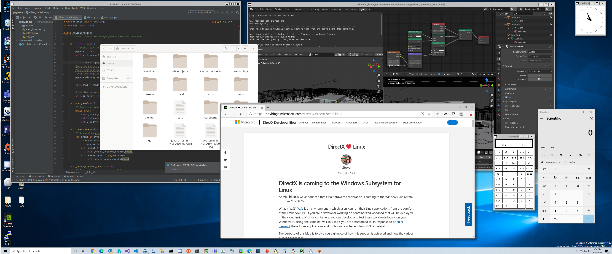
</p>

> źródło: https://github.com/microsoft/wslg

Nie będziemy tego tutaj omawiać, natomiast warto się nad tym przyjrzeć w wolnym czasie - odsyłam was do [dokumentacji Microsoft](https://learn.microsoft.com/en-us/windows/wsl/tutorials/gui-apps).

## Instalacja WSL

Na potrzeby kursu zainstalujemy najbardziej popularną dystrybucję Linuxa - [Ubuntu](https://ubuntu.com/). Jest to zwykle dobry wybór na start, szczególnie że ze względu na swoją popularność istnieje  duże wsparcie społeczności i gotowych rozwiązań w razie wystąpienia problemów, np. społeczność [Ask Ubuntu](https://askubuntu.com/) z sieci społecznościowej [StackExchange](https://stackexchange.com/) (tak, tam znajduje się również popularny [StackOverflow](https://stackoverflow.com/)).

### Wymagania WSL

Dla formalności - WSL można zainstalować tylko na Windows 10 w wersji 2004 lub wyższej (Build 19041 lub wyżej) albo na jakiejkolwiek wersji Windows 11.

Jeśli jednak nie jest pewne, na jakiej wersji pracujemy, to można w prosty sposób sprawdzić wersję Windowsa - wystarczy wcisnąć kombinację klawiszy <kbd><kbd></kbd> + <kbd>R</kbd></kbd>, co otworzy okno uruchamiania programów. W polu tekstowym należy wpisać `winver` i kliknąć _OK_.

<p align="center">
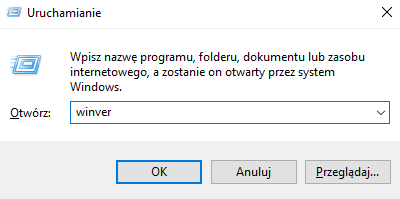
</p>

<p align="center">
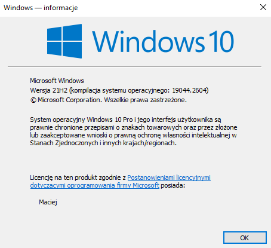
</p>

Jeżeli nie spełniamy wymagań, to polecam zaktualizować Windowsa. Teoretycznie jest to możliwe, aby zainstalować WSL2 na starszych wersjach, ale jest to bardziej skomplikowane i prościej jest zainstalować aktualizację Windowsa, dlatego nie będę tego tutaj omawiał. Jeżeli ktoś nie będzie mógł aktualizować Windowsa, to na własną odpowiedzialność może spróbować podążać [manualem](https://learn.microsoft.com/en-us/windows/wsl/install-manual) od Microsoftu.

### Najpierw to w ogóle trzeba mieć TERMINAL

_Kłamałem, nie trzeba mieć, ale zapewniam, że tak będzie wygodniej i czytelniej._

Faktycznie nie jest potrzebny osobny terminal/konsola, aby korzystać z WSL, natomiast do wygodniejszej pracy jako deweloper zaleca się mieć terminal, który potrafi trochę więcej i jest przyjemniejszy dla oka.

Dobrym rozwiązaniem, na początek, jest proponowane rozwiązanie od samego Microsoft - Windows Terminal. Ta aplikacja jest lekkim terminalem, który zapewnia praktycznie pełną modyfikację każdego aspektu programu do naszych potrzeb oraz działa na zasadzie kart - to oznacza, że w jednym oknie możemy mieć włączonych wiele instancji różnych konsol, gdzie każda konsola może mieć przypisany osobny profil konfiguracyjny. Dodatkowo, aplikacja oferuje domyślnie bardziej przyjazną dla oczu kompozycję kolorystyczną, która całkowicie można samemu dostosować.

**Jeżeli korzystasz z Windows 10, to tę aplikację musisz samodzielnie zainstalować. Instaluje się ją poprzez oficjalny sklep Microsoft.**
<p align="center">
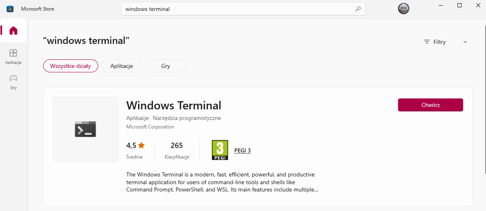
</p>
<!--  -->

**Jeżeli korzystasz z Windows 11, to Windows Terminal jest domyślną aplikacją konsolową w systemie.**

### Instalacja i logowanie

Aktualnie instalacja WSL2 jest prostsza niż na poprzednich wersjach Windowsa 10 (na Windowsie 11 jest domyślnie tak prosta) - wystarczy wpisać jedną komendę w Powershell lub w klasycznym, wbudowanym Wierszu Poleceń Windows (CMD):

1. W polu wyszukiwania Windowsa wpisz `powershell` lub `cmd` i na odpowiedni wynik wyszukiwania kliknij prawym przyciskiem myszy i wybierz _Uruchom jako Administrator_
<p align="center">
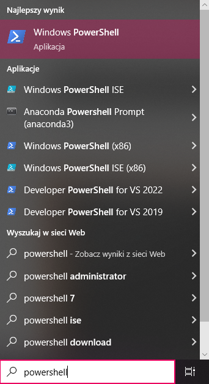
</p>

2. W otwartym oknie Powershella lub CMD wpisz:
   
   ```ps
   wsl --install
   ```
   Ta komenda uaktywni odpowiednie funkcje Windowsa potrzebne do działania WSL i rozpocznie automatyczne pobieranie i instalację Ubuntu:

    <p align="center">
    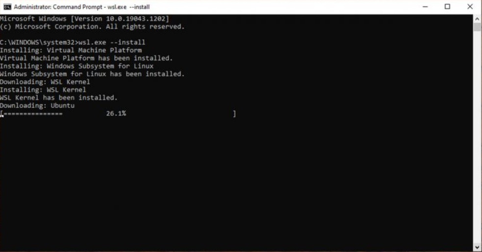
    </p>
    
    > źródło: https://www.omgubuntu.co.uk/how-to-install-wsl2-on-windows-10

3. Gdy instalacja się zakończy, trzeba uruchomić ponownie komputer. Przy ponownym zalogowaniu poczekaj, aż samodzielnie włączy się konsola, w której wcześniej przeprowadzana była instalacja. Postępuj zgodnie z poleceniami w konsoli, aż będziesz poproszony o założenie konta w Linuxie - nazwa użytkownika i hasło mogą być inne niż te, których używasz w Windowsie.

    <p align="center">
    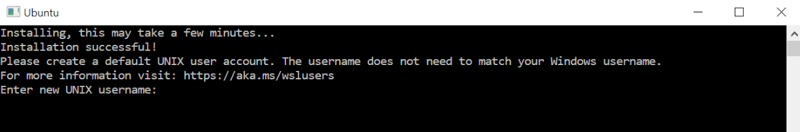
    </p>

    > źródło: https://learn.microsoft.com/en-us/windows/wsl/install-manual

    Kilka uwag do kont:

    - podczas ustalania hasła oraz później przy logowaniu wpisywane litery nigdy nie będą widoczne - jest to normalne,
    - stworzone konto jest domyślne i będzie ono automatycznie się logować przy następnych uruchomieniach
    - to konto (pierwsze utworzone) będzie traktowane jako administrator (superuser) - będzie miało zdolność do wykonywania komend z dopiskiem `sudo` (Super User Do)
    - przy instalacji kolejnych dystrybucji Linuxa na WSL trzeba za każdym razem tworzyć konto i te konta pomiędzy dystrybucjami są niezależne.

I to tyle, jeśli chodzi o instalację. Jest ona prosta, niemal całkowicie automatyczna. Dopiero w następnych krokach rozpocznie się prawdziwa zabawa, gdy będziemy dostosowywać terminal pod własne potrzeby, poznawać parę podstawowych komend do obsłużenia WSL oraz pierwszy raz używać Linuxa.

### Kurde, zapominałem hasła xD

To się naprawdę zdarza, często. Dlatego warto wiedzieć, jak temu szybko zaradzić.

1. Otwórz Powershella w terminalu twojego wyboru lub Powershella bezpośrednio.
2. W otwartym oknie Powershella wpisz:
    
    ```powershell
    wsl -u root
    ```
3. WSL zostanie wtedy otworzony na poziomie roota wewnątrz Powershella. Poziom roota oznacza to samo jak włączenie programu z uprawnieniami administracyjnymi, czyli jako superuser w Linux. Teraz, można użyć komendy Linuxa, która umożliwia zmianę hasła:
   
   ```bash
   passwd <nazwa uzytkownika>
   ```
4. Zostaniesz poproszony o wprowadzenie nowego hasła, a następnie potwierdzenie tego hasła. Po otrzymaniu informacji, że hasło zostało pomyślnie zaktualizowane, zamknij WSL wewnątrz Powershella za pomocą polecenia `exit`.

## Dostosowywanie Terminala
Przyszedł czas na przyjrzenie się terminalowi Windowsa. Poznamy jego przydatne funkcje i dostosujemy jego wygląd do własnych upodobań.

### Układ terminala

#### Powiększenie/zmniejszenie tekstu
Zacznijmy od widoku. Domyślnie, tekst w terminalu jest całkiem spory. Można to łatwo i intuicyjnie zmienić w każdym momencie - tak jak w przeglądarkach internetowych przybliżać i oddalać można za pomocą przesuwania rolki myszy, jednocześnie trzymając <kbd>Ctrl</kbd>. 

#### Panele
Widok terminala można dzielić. Czasem się zdarza, że trzeba coś kontrolować na raz, np. zużycie zasobów komputera w czasie obliczeń lub trzeba coś spisać - wtedy idealnie sprawdza się podzielenie widoku, gdzie na dwóch panelach będzie pokazana ta sama sesja systemu. Aby podzielić ekran można użyć skrótu klawiszowego lub kliknąć prawym przyciskiem myszy na aktywną kartę i wybrać opcję _Split tab_ lub użyć skrótu klawiszowego: <kbd>Alt</kbd>+<kbd>Shift</kbd>+<kbd>+</kbd>(podział wetykalny) lub <kbd>Alt</kbd>+<kbd>Shift</kbd>+<kbd>-</kbd> (podział horyzontalny).

<p align="center">
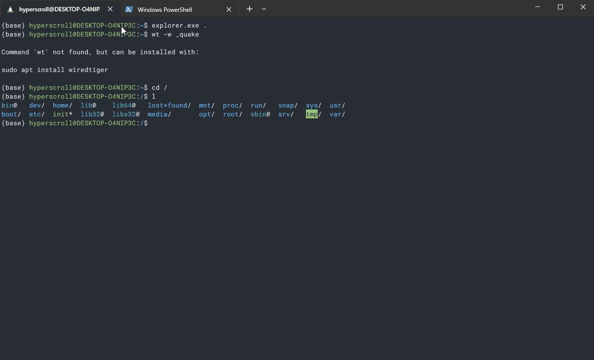
</p>

Kolejne użycia _Split tab_ będzie powodowało dalsze dzielenie widoku.

Aby aktywować poszczególne panele, można na nie kliknąć myszką lub przełączać się między nimi za pomocą skrótu klawiszowego: <kbd>Alt</kbd>+ strzałka. Aktywny panel ma pokolorowane swoje krawędzie (kolor różni się od aktualnej kompozycji kolorystycznej - na gifie powyżej jest to kolor [#EF5B89](https://g.co/kgs/pKTimY)).

Ponadto, można zmieniać rozmiar paneli. Niestety, nie da się rozmiaru zmienić poprzez przesunięcie krawędzi - jest to jedynie możliwe używając skrótu klawiszowego: <kbd>Alt</kbd>+<kbd>Shift</kbd>+strzałki

<p align="center">
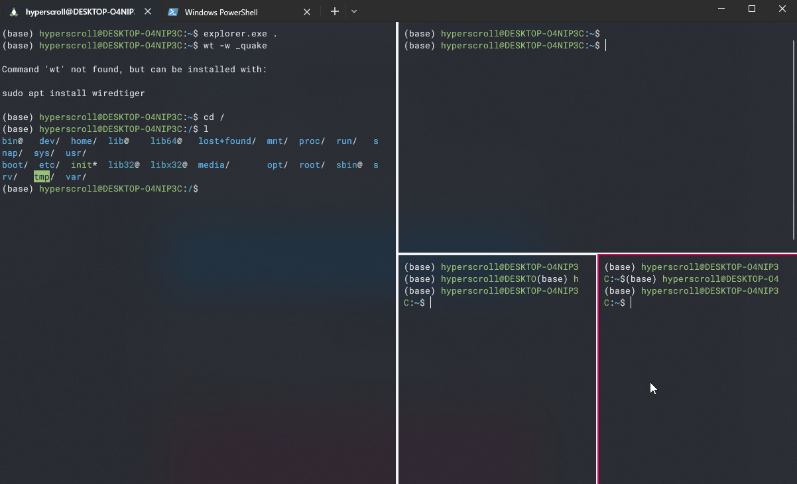
</p>

Szybko się może okazać, że nie wiadomo jak zamknąć te panele. Też mi się zdarzyło panikować z tego powodu, ponieważ nie ma żadnego elementu w interfejsie, który za to odpowiada. Znowu musimy polegać tylko na skrótach: <kbd>Ctrl</kbd>+<kbd>Shift</kbd>+<kbd>W</kbd> - zamknie aktualnie używany panel.

#### Karty
Każda karta, tak jak w przeglądarce internetowej, oddziela inną zawartość. Tutaj jedna karta oznacza osobną konsolę odpowiedzialną za coś innego. Windows Terminal ma parę predefiniowanych rodzajów kart, które można włączyć, np. Powershell lub CMD. Po zainstalowaniu Linux pojawia nam się w tej liście jako Ubuntu. Jest tam jeszcze parę innych pozycji, ale nie będziemy ich omawiać. W dalszej części tekstu nauczymy się tworzyć takie _profile_, aby móc je otwierać jako osobne _karty_.

Każdy profil można otworzyć jako nową kartę, ale w nowym panelu - przy otwieraniu nowej kart trzeba przytrzymać <kbd>Alt</kbd>.

<p align="center">
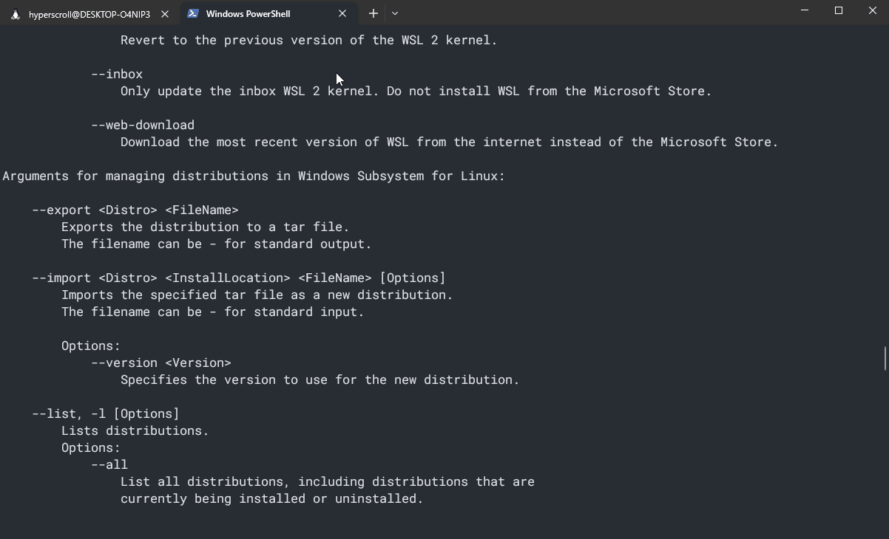
</p>

Naturalnie, można sobie oszczędzić klikania na dropdown wszystkich profili - na gifie można zauważyć, że każdy profil ma przypisany odpowiedni skrót klawiszowy, który otworzy go w nowej karcie.

Ponadto, można wyróżniać instancje kart - możliwa jest zmiana nazwy karty oraz można ją wyróżnić kolorem:

<p align="center">
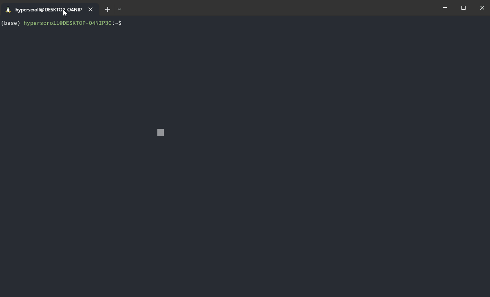
</p>

### Kopiowanie do i z terminala
Wbrew pozorom, jest to bardzo wazna część pracy z terminalem, która przy odpowiednich ustawieniach potrafi znacznie usprawnić, ale te i zabezpieczyć nasze ruchy.

Przede wszystkim trzeba sobie powiedzieć o tym, że często tekst, który kopiujemy, może zawierać białe znaki - są to spacje, ale też niewidoczne znaki nowej linii oraz tabulacji. Znaki końca linii są źródłem wielu nieporozumień - są one różne w zależności od systemu. Systemy Linux korzystają ze zwyczajnych znaków **_nowej linii_**, które oznacza się jako `\n` w surowym tekście. Z kolei Windows korzysta z podwójnego znakowania, w którym przed znakiem nowej linii znajduje się **_carriage return_** (popularnie nazywany  po polsku **_karetką_**) - oznaczane są jako `\r\n`. Te znaki, w sformatowanym tekście, czyli takim, który zwykle widzi użytkownik, nie są widoczne. Pomimo tego, mogą być one czasem skopiowane. Jeżeli się tak zdarzy i wkleimy taki tekst do terminala, to znaki końca/nowej linii zostaną potraktowane jako _Enter_, co może spowodować niepożądaną próbę wykonania polecenia. Co ciekawe, te znaki nie tylko wywołują problemy w terminalach, ale również potrafią przyprawić o prawdziwy ból głowy i wielogodzinne straty czasu programistów. [Tutaj](https://superuser.com/questions/374028/how-are-n-and-r-handled-differently-on-linux-and-windows) można poczytać więcej o tym, dlaczego takie znaki występują.

Na szczęście Windows Terminal jest na tyle mądrą aplikacją, że ma pewne środki w zanadrzu, aby móc się mniej przejmować tymi znakami.

Przede wszystkim, terminal zwykle z automatu jest w stanie wykryć tekst, w którym znajdują się opisywane wcześniej znaki i wyświetla ostrzeżenie. Takie ostrzeżenie występuje również w przypadku, gdy chcemy wkleić wieloliniowy tekst, co generalnie nie jest zachowaniem pożądanym w terminalnach, ponieważ wieloliniowy tekst jest zwykle traktowany jako wiele komend, które mają być wykonane sekwencyjnie - jedna linia, to jedna komenda.

Tutaj dowód na to, że można sobie wytworzyć mały kataklizm, jeśli zignorujemy ostrzeżenia:

<p align="center">
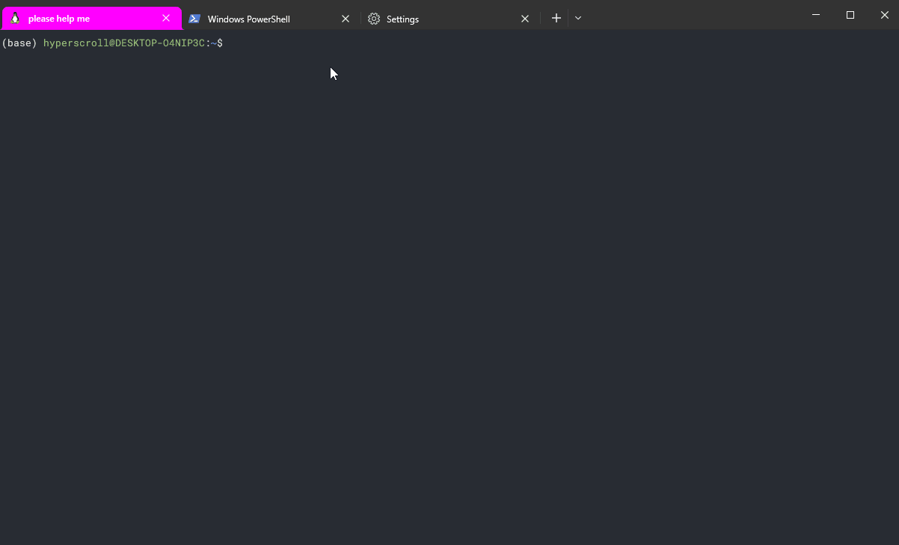
</p>

Ponadto, mimo że są ostrzeżenia, to możemy zmusić terminal, aby zawsze usuwał z kopiowanego tekstu odstające na końcach znaki nowych linii (w przypadku pojedynczych linii). Aby to zrobić, należy wejść do ustawień terminala, przejść do sekcji _Interaction_ i zaznaczyć następujące opcje: **_Remove trailing white-space in rectangular selection_** oraz **_Remove trailing white-space when pasting_**. **Na koniec koniecznie zapisz.** Warto zauważyć, że te opcje mogą być włączone domyślnie (wiec tylko lepiej).

<p align="center">
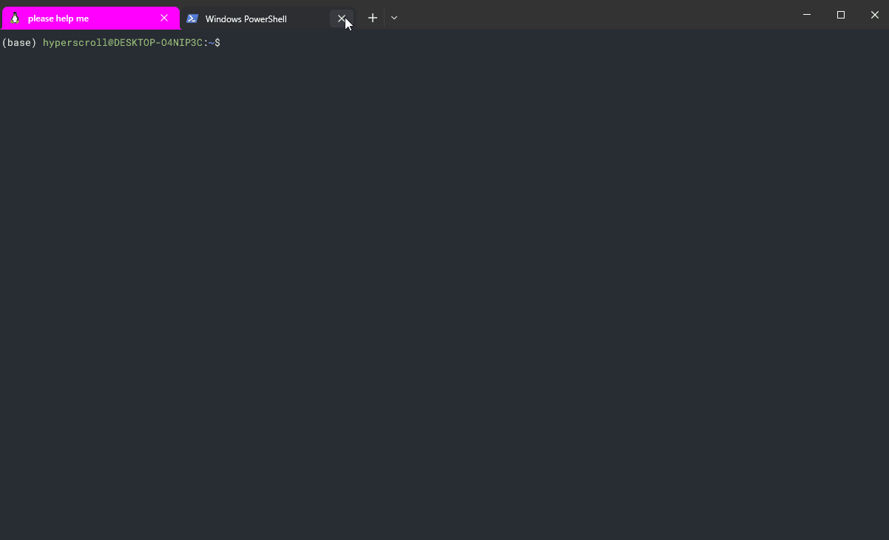
</p>

Windows Terminal wprowadza również wiele sposobów na kopiowanie i wklejanie zawartości, co może usprawnić pracę:

- wiele skrótów klawiszy na kopiowanie i wklejanie (każdy skrót jest konfigurowalny - o tym bedzie wiecej w następnym dziale):
  
  - wklejanie: <kbd>Ctrl</kbd>+<kbd>C</kbd>; <kbd>Ctrl</kbd>+<kbd>Shift</kbd>+<kbd>C</kbd>; <kbd>Ctrl</kbd>+<kbd>Insert</kbd>
  - kopiowanie: <kbd>Ctrl</kbd>+<kbd>V</kbd>; <kbd>Ctrl</kbd>+<kbd>Shift</kbd>+<kbd>V</kbd>; <kbd>Shift</kbd>+<kbd>Insert</kbd>

- wciśnięcie prawego przycisku myszy na wolnej przestrzeni wklei zawartość ze schowka
- zaznaczenie tekstu w terminalu i kliknięcie prawym przyciskiem myszy na zaznaczeniu skopiuje zaznaczenie
- opcjonalne jest również automatyczne kopiowanie zaznaczenia do schowka - opcja _Automatically copy selection to clipboard_ w sekcji _Interaction_

### Przegląd ustawień globalnych
Przyjrzymy się teraz wybranymi ustawieniami ze wszystkich sekcji (oprócz tych związanych z kompozycjami kolorów), które najbardziej warto przystosować do swoich potrzeb.

#### Startup

- _Domyślny profil (ang. Default profile)_ -  ustawia jaki profil konsoli będzie włączany na starcie terminala. Jeśli głównie będziesz używać terminala ze względu na Linuxa, to warto ustawić profil Linuxa jako domyślny
- _Włącz przy starcie komputera (ang. Launch on machine startup)_ - polecam tę opcję mieć wyłączoną, ponieważ na starcie komputera będziemy tracić zasoby, a przecież właczenie reczne terminala praktycznie nic nie kosztuje :)
- _Kiedy terminal się włącza (ang. When Terminal starts)_ - są dwie opcje do wyboru - albo zawsze terminal ma się włączać z domyślnym profilem w nowej karcie, lub terminal będzie przywracał układ kart z poprzedniej sesji. Jeśli wiemy, że będziemy wracać do pewnej pracy przez jakiś czas, to warto ustawić przywracanie poprzedniej sesji (ang. _Open windows from a previous session_)

#### Interaction
W tej sekcji już parę opcji dotyczących kopiowania sobie ustawialiśmy. Nie mniej, jest jeszcze parę opcji, nad którymi warto się pochylić:

- _Format tekstu przy kopiowaniu (ang. Text format when copying)_ - możemy tutaj zadecydować, czy kopiowany tekst może być w jakiś sposób formatowany, np. czasem może być zachowany kolor tekstu. Ja polecam wybrać tutaj opcję _Plain text only_, ponieważ mamy wtedy pewność, że dostarczany tekst do terminala jest jak najbardziej surowy (o tym już wspomnieliśmy trochę w sekcji o [kopiowaniu do i z terminala](#kopiowanie-do-i-z-terminala))
- _Automatycznie wykrywaj URL i rób je klikalne (ang. Automatically detect URLs and make them clickable)_ - terminal automatycznie będzie wykrywał linki - będą one podkreślone i kilknięcie na nie z przytrzymanym <kbd>Ctrl</kbd> spowoduje ich otworzenie w domyślnej przeglądarce internetowej.
- _Ostrzegaj przy zamknięciu wielu kart (ang. Warn when closing more than one tab)_ - tak jak nazwa wskazuje, warto się ubezpieczyć od tzw. _miss-clicków_

#### Appearance

- _Ukryj pasek tytułowy (ang. Hide title bar)_ - tak jak w tytule - ukrywany jest pasek tytułowy, co pozwala zwiększyć przestrzeń pracy

<p align="center">
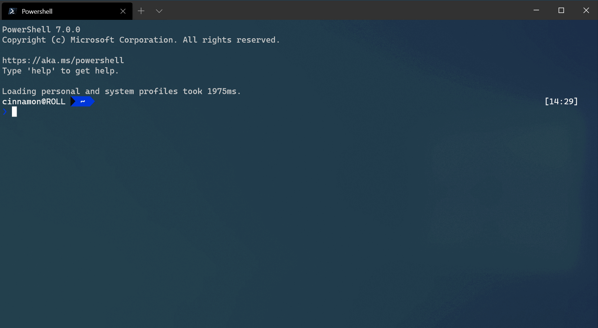
</p>

> źródło: https://learn.microsoft.com/en-us/windows/terminal/customize-settings/appearance#hide-the-title-bar

- _Zawsze na wierzchu (ang. Always on top)_ - okno terminala będzie zawsze na wierzchu względem innych okien. Czasem to się może przydać w dużym tłoku okien, ale sam tego nie używam.
- _Tryb szerokości kart (ang. Tab width mode)_ - można ustawić różne szerokości kart, domyślnie jest ustawiona szerokość równa dla wszystkich. Jeśli jednak otwiera się dużo kart, to dobrze jest ustawić szerokość na _compact_, co sprawi, że karty zostaną ściśnięte tylko do szerokości ikon kart.

#### Rendering
Znajdują się tutaj ustawienia związane z graifcznym "rysowaniem" terminala. Sekcja techniczna i niespecjalnie istotna w kontekście naszego kursu. Dla ciekawych: [dokumentacja Microsoft](https://learn.microsoft.com/en-us/windows/terminal/customize-settings/rendering) 

#### Actions
W tej sekcji mamy wymienione wszystkie dostępne skróty klawiszowe. Każdy z nich można zmieniać, a ponadto, można również dodać nowe. Polecam sobie je przejrzeć i próbować niektóre zapamiętać, jak i również ich używać, bo skróty przyspieszają pracę. Natomiast, nic się nie stanie, jeżeli nie będziemy używać żadnych skrótów, ponieważ większość funkcji może być zarządzana poprzez mysz.

### Wygląd terminala
W sekcji _Color schemes_ znajdują się predefiniowane schematy kolorystyczne, które można będzie wybrać w profilach. Każdy z tych predefiniowanych schematów można edytować oraz możliwe jest również stworzenie własnego schematu. Dobry wygląd terminala to podstawa, ponieważ często będzie się na niego patrzeć przez kilka godzin, zatem warto, aby cieszył on nasze oko i nie psuł widoczności.

Istnieją również strony ze schematami stworzonymi przez innych użytkowników lub przez Microsoft:

- https://terminalsplash.com/
- https://learn.microsoft.com/en-us/windows/terminal/custom-terminal-gallery/custom-schemes

Niestety ich "instalacja" nie jest prosta dla nowych użytkowników terminala, ponieważ da się je dodać jedynie poprzez edycję pliku konfiguracyjnego, który ma strukturę [JSON](https://developer.mozilla.org/en-US/docs/Learn/JavaScript/Objects/JSON) (JavaScript Object Notation). Nie będziemy sobie teraz tłumaczyć czym jest JSON oraz instalacji, ale dla chętnych można się tego nauczyć [tutaj](https://youtu.be/5WL7okpz5Ig).

### Profile terminala
 Profil reprezentuje konfigurację terminala dla określonej konsoli, którą można otworzyć w nowej karcie. Profile w Terminalu umożliwiają dostosowanie różnych ustawień, w tym argumentów wiersza poleceń, katalogu startowego dla konsoli, czcionki, schematu kolorów i skrótów klawiszowych. Do każdego profilu można również przypisać niestandardową ikonę, aby ułatwić jego identyfikację.

 W sekcji profili, pierwszym jest profil domyślny, który będzie przyjmowany przez każdy nowo tworzony profil. Jego ustawienia można całkowicie pominąć i skupić się na dostosowywaniu ustawień istniejących profili, a w szczególności profilu Linuxa:

 - _Folder startu (ang. Starting directory)_ - folder, w którym będziemy się znajdować na starcie konsoli. O poruszaniu się po Linuxie i folderach będzie w następnych tematach
 - _Uruchom jako administrator (ang. Run this profile as Administrator)_ - czasem otwarcie profilu jako administrator umożliwi wykonanie pewnych akcji.

Są jeszcze dodatkowe ustawienia, które są podzielone na dwie podsekcje, w których przede wszystkim można zmienić:

- Appearance:
  - schematy kolorów
  - ustawienia czcionki
- Advanced:
  - _wielkość historii (ang. history size)_- ile linii zostaje zapamiętanych wstecz
  - _Styl "dzwoniących" powiadomień (ang. Bell notification style)_ - są to specjalne powiadomienia, które informują o niektórych wydarzeniach, np. wciśnięcie <kbd>Backspace</kbd>, gdy nie ma żadnego wpisanego tekstu. Domyślnie jest ustawione dźwiękowe powiadomienie, które jet skrajnie irytujące. Polecam odznaczyć ten sposób i zaznaczyć opcję _Flash window_, która sprawi, że w momencie wyżej opisanego wydarzenia delikatnie błyśnie nam obszar roboczy terminala.
  
    <p align="center">
    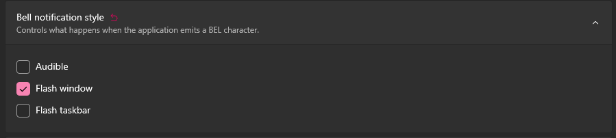
    </p>

    <p align="center">
    
    </p>

### Paleta komend
Po wciśnięciu kombinacji klawiszy <kbd>Ctrl</kbd>+<kbd>Shift</kbd>+<kbd>P</kbd> pojawi się dok z polem tekstowym, w którym można wpisywać komendy sterujące terminalem lub przeszukać listę aktualnie dostępnych akcji. Przykładowo, jeżeli chcemy zobaczyć jakie akcje są dostępne odnośnie czcionki, to wystarczy wpisać `font` i wyświetli się lista aktualnie możliwych akcji.

<p align="center">
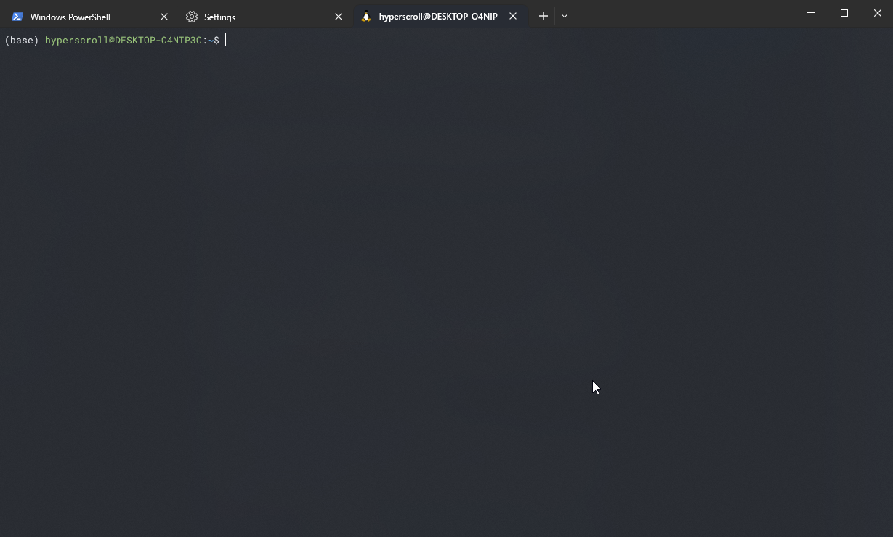
</p>

Paleta komend ma znacznie potężniejsze funkcje, jednak są one bardzo specyficzne i wymagają znajomości zaawansowanych komend oraz ich odpowiedniej składni. Dla zainsteresowanych - można o tym przeczytać w [dokumentacji Microsoftu](https://learn.microsoft.com/en-us/windows/terminal/command-palette).

### Przeszukiwanie zawartości
W Windows Terminal można słownie przeszukiwać bufor tekstowy (całkowitą zawartość tekstową w obszarze roboczym). Działanie jest podobone do przeszukiwania, które zapewniają przeglądarki internetowe. 

Aby włączyć przeszukiwanie, należy użyć kombinacji klawiszy <kbd>Ctrl</kbd>+<kbd>Shift</kbd>+<kbd>F</kbd>.


## Aktualizacja Linuxa i zapoznanie z managerem pakietów
Zanim zaczniemy właściwie korzystać z Linuxa, dobrą praktyką jest całkowite zaktualizowanie paczek znajdujących się w systemie. Na paczki składa się różne oprogramowanie, które znajduje się w systemie - mogą być to komponenty niezbędne dla systemu lub zupełnie dodatkowe programy, które są preinstalowane lub instalowane przez nas. Oprogramowanie w Linuxie można instalować "ręcznie" lub można używać managera paczek, który cały ten proces automatyzuje. Manager paczek jest różny w zależności od dystrybucji Linuxa.

Domyślnym managerem paczek w Ubuntu jest _apt_ (skrót od ang. Advanced Package Tool). Manager paczek pozwala na łatwe wyszukiwanie, instalowanie, aktualizowanie i usuwanie pakietów oprogramowania z systemu. Zasada działania apt jest prosta, ponieważ używa systemu repozytoriów, który zawiera zbiór pakietów oprogramowania dostępnych do pobrania i instalacji. Taki system repozytoriów zapewnia scentralizowane miejsce dla deweloperów do dystrybucji ich pakietów oprogramowania i ułatwia użytkownikom znalezienie oraz instalacje nowego oprogramowania w ich systemach. Takie managery paczek mają najczęściej jedną wadę - zatwierdzone i zindeksowane pakiety w repozytorium są często w wersjach niezbyt aktualnych i czasem pewne oprogramowanie jest lepiej zainstalować samemu.

Aby zaaktualizować wszystkie pakiety w systemie wpisz w Linuxie:

```bash
sudo apt update && sudo apt upgrade
```
`apt update` aktualizuje lokalną bazę paczek, pobierając informacje o nich ze zdalnego repozytorium, czyli realnie ta komenda nie instaluje żadnych aktualizacji. Tę aktualizację wykonuje `apt upgrade`, ale to nie zadziała, bez uprzedniego pobrania informacji ze zdalnego repozytorium, czyli wykonania `apt update`.

Oczywiście, zanim cokolwiek się uruchomi, system zapyta cię o hasło superusera (dlatego pamiętanie go jest takie ważne xD), ponieważ polecenie zostało uprzedzone `sudo`. 

<p align="center">
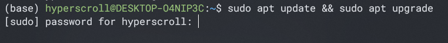
</p>

Jeśli ten krok się uda, to zostaniesz szybko przywitany ścianą tekstu. Nie ma co się jej bać, tak po prostu apt raportuje wszelkie zmiany i operacje, które wykonuje.

Niestety, w pewnym momencie zostanie wywołane krótkie zatrzymanie akcji serca, ponieważ wszystko stanie. To dlatego, że apt pyta się użytkownika, czy zgadza się na pobranie i aktualizację tego, co aktualnie wychwycił z repozytorium  oraz czy przymuje do wiadomości ile danych będzie musiał pobrać, oraz ile one zajmą miejsca na dysku. Oczywiście w pełni świadomości tego, co tam się znajduje i z bezgranicznym zaufaniem zgadzamy się na dalsze działanie apt - trzeba wpisać literę <kbd>Y</kbd>.

<p align="center">
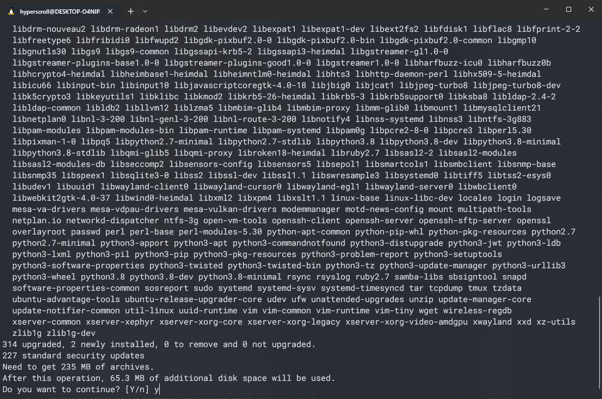
</p>

Po zaakceptowaniu, dalej będzie nas zalewać ściana tekstu z raportowania apt. Na szczęście, podczas etapu pobierania i instalowania będzie widoczny procent i pasek postępu, więc od razu będzie wiadomo jak długo ta męka potrwa.

### Przegląd poleceń apt

#### apt install
Najważniejszym poleceniem jest oczywiście `apt install <nazwa paczki>`, która instaluje podaną paczkę. Jeżeli paczka nie zostanie znaleziona z powodu złej nazwy (a literówki będą nagminne), to jest duża szansa, że apt samo nam podpowie, o jaką nazwę paczki nam może chodzić. Podobna sytuacja może nastąpić, jeśli wywołamy program, który nie jest zainstalowany.

Spróbujmy zainstalować paczkę (neofetch), która pokaże nam szczegóły o zainstalowanym systemie i krótkie podsumowanie sprzętowe - taki odpowiednik _System_ z Windowsa. Najpierw wywołajmy ją bez instalacji:

```bash
neofetch
```
Prawdopodobnie pojawi się taki komunikat:

<p align="center">
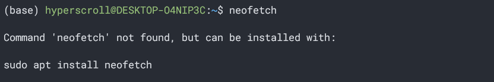
</p>

Zatem podążając za podpowiedzią wpisujemy tę komendę:

```bash
sudo apt install neofetch
```

Jeżeli wpisałeś tę komendę bez wyłączania terminala, to możesz zauważyć, że tym razem nie trzeba było wpisywać hasła superusera. Dzieje się tak, ponieważ domyślnie po jednorazowym wpisaniu hasła przy wywołaniu z `sudo`, Linux zapamiętuje, że z komputera korzysta teraz superuser.

Po poprawnej instalacji możesz uruchomić `neofetch` i po chwili powinien pojawić się podobny wynik jak na screenie:

<p align="center">
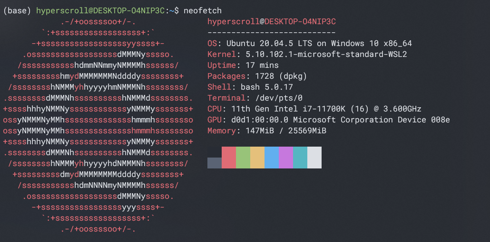
</p>

#### apt show
Komenda ciekawostka, która wyświetla szczegółowe informacje o pakiecie, w tym jego wersję, zależności i rozmiar instalacji. Nie mniej, informacja o wersji paczki jest często przydatna, ponieważ różne wersje mogą różnie działać i współgrać z innymi pakietami w systemie. Z tego powodu, czasem trzeba zainstalować konkretną wersję paczki. Aby zainstalować konkretną wersję, należy dopisać numer wersji po nazwie pakietu:

```bash
sudo apt install <nazwa paczki>=<wersja>
```

**Pomiędzy nazwą, a wersją znak `=` jest konieczny.**

#### apt remove
Drugim najważniejszym poleceniem jest `apt remove <nazwa paczki>`, która pozwala usunąć pakiet z systemu. Zasada działania jest taka sama jak w przypadku `apt install`. Jedyną różnicą jest to, że nie otrzymujemy propozycji paczek do usunięcia, jeżeli wpiszemy złą nazwę.

Spróbujmy usunąć uprzednio zainstalowanego neofetcha, **ale tym razem nie wpiszemy komendy na nowo. W terminalach jest możliwość cofania się do poprzednio wykonanych komend za pomocą strzałek (góra/dół)** - spróbuj powrócić do poprzedniej komendy i ja zmodyfikuj, aby wyglądała następująco:

```bash
sudo apt remove neofetch
```

Oczywiście nic się nie stanie bez naszego zatwierdzenia. Przed samym odinstalowywaniem apt zapyta nas, czy na pewno chcemy usunąć wskazane przez niego komponenty. Akceptacja następuje, oczywiście, poprzez wpisanie litery <kbd>Y</kbd>.

<p align="center">
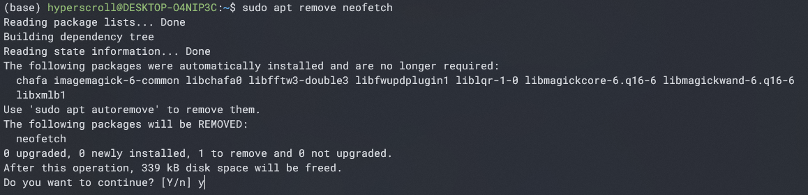
</p>

Na powyższym screenie można zauważyć jeszcze jedną rzecz - o ile sam neofetch zostanie usunięty, to `apt remove` automatycznie nie usuwa komponentów zależnych (ang. dependencies), które były zainstalowane wraz z neofetchem. `apt remove` informuje, że te wskazane komponenty nie są już potrzebne i mogą zostać usunięte poprzez `sudo apt autoremove`. Zatem `apt remove` domyślnie jest bardzo powściągliwy w swoim działaniu.

#### apt search
To polecenie pozwala przeszukiwać bazę danych pakietów w poszukiwaniu pakietów pasujących do podanego zapytania. Jako wynik otrzymujemy listę paczek, które w swojej nazwie zawierają podany ciąg znaków:

<p align="center">
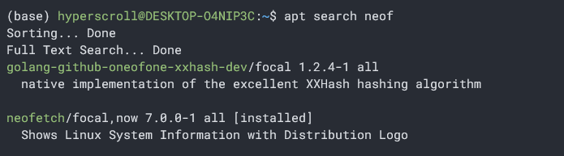
</p>

## Podstawowa obsługa WSL
Już poznaliśmy trochę obsługi WSL - używaliśmy komendy do zainstalowania Linuxa oraz pokazaliśmy sobie jak wejść do WSL od zewnątrz, w Powershellu, aby móc zmienić sobie zapomniane hasło. Istnieje jeszcze parę funkcji, które warto znać, aby szybko sobie poradzić z pewnymi sytuacjami lub sprawdzić pewne informacje.

> PSA: ponżej będą wymienione wybrane komendy dotyczące WSL, które mogą się przydać, ale dla potrzeb kursu nie polecam ich wszystkich teraz testować - mogą one popsuć doświadczenia w przyszłych tematach. Takie komendy oznaczę gwiazdką.

### Dostęp do plików pomiędzy systemami
Dużą zaletą WSL jest to, że z poziomu Linuxa można wykonywać komendy Windowsa oraz z poziomu Powershella komendy z Linuxa.

Najbardziej przydatną rzeczą może być dostęp do plików z Linuxa z poziomu Eksploratora Plików Windowsa. Będąc w Linuxie wystarczy wpisać:

```bash
explorer.exe .
```
Ważna jest tutaj `.` - więcej o tym będzie w następnych tematach, ale taka **samotna kropka oznacza _obecny folder_**.

To polecenie wyświetli Eksplorator Windowsa w folderze Linuxa, z którego wykonano polecenie (tutaj folder mojego profilu użytkownika).

<p align="center">
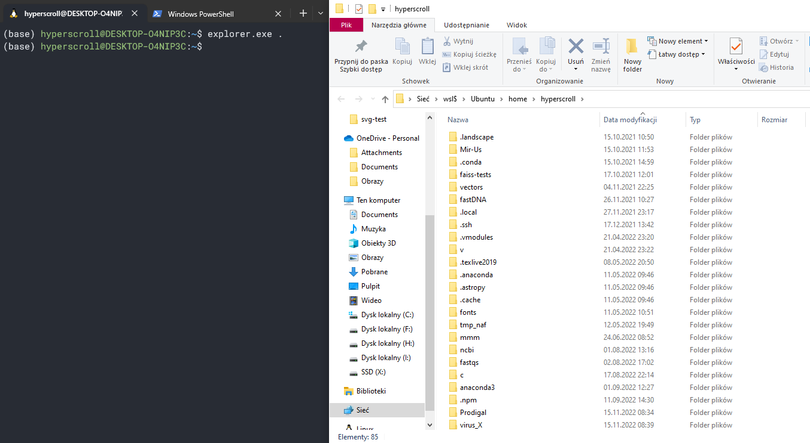
</p>

Ponadto, po poprawnej instalacji WSL, w Eksploratorze Windowsa powinna się pojawić pozycja _Linux_ w widoku drzewa plików (lista folderów i dysków w po lewej stronie Eksploratora Plików). Dzięki temu można szybko z poziomu Windowsa przenieść pliki z Linuxa do Windowsa, bez włączania terminala. Warto zauważyć, że uzyskując dostęp do Linuxa w ten sposób, znajdziemy się w głównym folderze całego Linuxa - taki folder nazywa się _root_.

<p align="center">
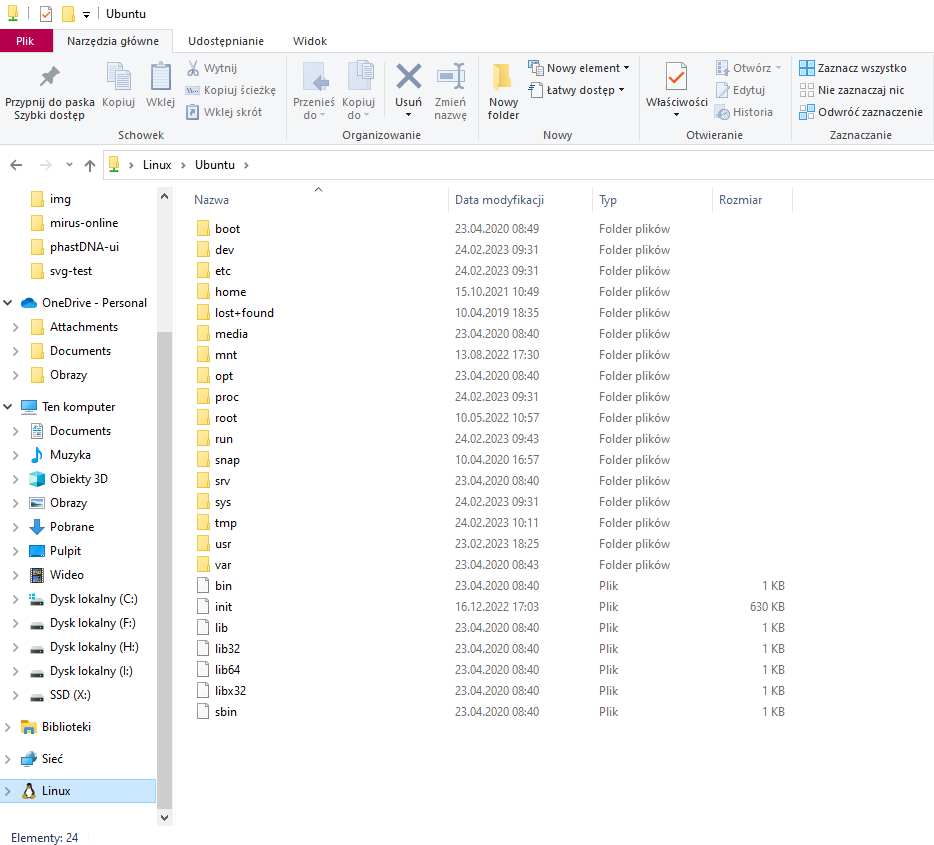
</p>

W przyszłych tematach omówimy dostęp do plików Windowsa z poziomu Linuxa za pomocą komend i Linuxa z poziomu Windowsa za pomocą komend.

### Wyłączenie WSL
Koniecznie trzeba znać komendę na wyłączenie WSL po zakończeniu pracy, aby WSL nie zabierało nam zasobów komputera, szczególnie pamięci RAM:

```powershell
wsl --shutdown
```

### Dodatkowe dystrybucje Linuxa
W WSL można mieć zainstalowanych wiele dystrybucji Linuxa. Tak jak wspominałem wcześniej, na potrzeby kursu będziemy się trzymać Ubuntu, natomiast wraz ze zdobywanym doświadczeniem z Linuxem być może będziesz chciał wypróbować inne dystrybucje. Z tego względu nie będę omawiał tutaj instalacji dodatkowych dystrybucji, natomiast istnieje w [dokumentacji Microsoftu poradnik krok po kroku](https://learn.microsoft.com/en-us/windows/wsl/install#change-the-default-linux-distribution-installed) jak to zrobić.

Aby sprawdzić, jakie są dostępne oficjalne dystrybucje przygotowane przez Microsoft, należy wpisać następujące polecenie w Powershellu:

```powershell
wsl --list --online
```

Przy okazji tej komendy, WSL od razu zaproponuje polecenie, którym można zainstalować nową dystrybucję.

<p align="center">
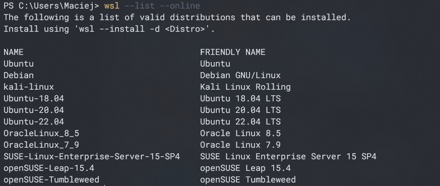
</p>

Można również sprawdzić, jakie są aktualnie zainstalowane dystrybucje w WSL:

```powershell
wsl --list --verbose
```

Jeżeli jest więcej dystrybucji, to jest możliwe ustawienie domyślnej dystrybucji Linuxa, która będzie obsługiwać komendy WSL wpisywane z Powershella:

```powershell
wsl --set-default <nazwa dystrybucji>
```

### Status WSL
Aby sprawdzić informacje o tym, jaką posiadamy aktualnie wersję WSL, kiedy była ostatni raz aktualizowana oraz jaka dystrybucja jest przypisana do WSL domyślnie, należy wpisać następującą komendę:

```powershell
wsl --status
```

**Uwaga: jeżeli czujemy się zagubieni w komendach, to możemy przeczytać o wszystkich dostępnych komendach, wpisując `wsl --help`.**

### Zmiana wersji i aktualizacja WSL*
Tak jak wcześniej sobie opisywaliśmy, czasem przydaje się zmienić wersję z WSL2 na WSL1 lub na odwrót. Można tego dokonać poprzez wpisanie następującej komendy w Powershellu:

```powershell
wsl --set-version <nazwa dystrybucji> <number wersji WSL>
```

Jednak ta zmiana dotyczy tylko konkretnej dystrybucji. Jeżeli chcemy globalnie zmienić wersję, to wpisujemy:

```powershell
wsl --set-default-version <numer wersji WSL>
```

Czasem warto zaktualizować WSL, np. z kwestii bezpieczeństwa:

```powershell
wsl --update
```

Lista aktualizacji i zmian w nich wprowadzanych jest dołączona do [dokumentacji WSL Microsoftu](https://learn.microsoft.com/pl-pl/windows/wsl/release-notes).

### Przenoszenie dystrybucji Linuxa*
Ciekawą i przydatną funkcją jest możliwość przenoszenia dystrybucji Linuxa. Chodzi tutaj o to, że można całą swoją aktualną dystrybucję spakować do archiwum, a później, np. po formacie komputera można ją z tego archiwum przywrócić.

Eksportowanie (zarchiwizowanie) dystrybucji:

```powershell
wsl --export <nazwa dystrybucji> <nazwa pliku docelowego>
```

Importowanie (przywracanie) dystrybucji:

```powershell
wsl --import <nazwa dystrybucji> <miejsce instalacji> <nazwa pliku archiwum>
```
## Męki jest koniec
>Dzięki za przeczytanie tego tematu. Nie był on łatwy, tym bardziej że jesteśmy dopiero na początku przygody z Linuxem i widok terminala może być lekko niepokojący, a ilość nowych i często nieintuicyjnych rzeczy jest duża. Następne części będą bardziej skupiać się na konkretnych zagadnieniach i będzie mniej różnych wątków wrzucanych na raz. Niestety początki z Linuxem nie są łatwe, ale będzie odtąd coraz lepiej.

---

| [Poprzedni Temat](https://github.com/AvirFrog/The_Curse_of_Linux) | [Strona główna](https://github.com/AvirFrog/The_Curse_of_Linux) | [Następny Temat](https://github.com/AvirFrog/The_Curse_of_Linux) |
| :---------------------------------------------------------------: | :-------------------------------------------------------------: | :--------------------------------------------------------------- |
