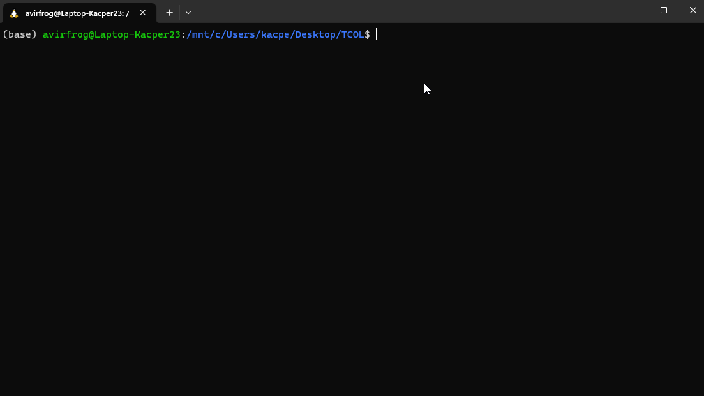

# Temat 02: Jak poruszać się po Linuxie?

## Spis treści

<details>
<summary>Kliknij by rozwinąć</summary>

- [Temat 02: Jak poruszać się po Linuxie?](#temat-02-jak-poruszać-się-po-linuxie)
  - [Spis treści](#spis-treści)
  - [Kilka rzeczy, które ułatwią Ci życie w dalszej części tego kursu](#kilka-rzeczy-które-ułatwią-ci-życie-w-dalszej-części-tego-kursu)
    - [Jeśli czegoś nie wiesz, spytaj o pomoc](#jeśli-czegoś-nie-wiesz-spytaj-o-pomoc)
    - [Pobierzmy coś z internetu](#pobierzmy-coś-z-internetu)
  - [Przydatne polecenia](#przydatne-polecenia)
    - [pwd](#pwd)
    - [cd](#cd)
      - [Tab i Strzałki](#tab-i-strzałki)
      - [Co jeśli się zgubię?](#co-jeśli-się-zgubię)
    - [ls](#ls)
      - [Przyjrzyjmy się bliżej dłuższej formie.](#przyjrzyjmy-się-bliżej-dłuższej-formie)
    - [file](#file)
    - [less](#less)
  - [Hierarchia katalogów](#hierarchia-katalogów)

</details>

## Kilka rzeczy, które ułatwią Ci życie w dalszej części tego kursu

Jest to pierwszy temat, w którym zaczniemy pracować bardziej na poważnie w wierszu poleceń za pomocą terminalu. Poznamy tu podstawowe zagadnienia związane z systemem Linux. W dalszej części tego tematu dowiemy się jak poruszać się po katalogach (możesz je kojarzyć pod nazwą "Foldery"), nauczysz się jak sprawdzić zawartość takiego katalogu, nauczysz się określać typy plików i sprawdzać ich zawartość.

Aby to wszystko wytłumaczyć, musimy wejść na głęboką wodę i trochę wyprzedzić nasz kurs, dlatego bez tłumaczenia jak dokładnie działa (w tym rozdziale, bo na to przyjdzie odpowiednia pora) poznasz polecenie umożliwiające pobieranie rzeczy z internetu.

Normalnie, jeśli chcesz pobrać coś z internetu, odpalasz przeglądarkę i pobierasz interesujący cię plik. W naszym przypadku też możemy tak zrobić, ponieważ działamy na subsystemie Linuxa więc mamy do dyspozycji Windowsa. Ale nauczymy się korzystać z polecenia `wget`, które umożliwi nam pobieranie plików z internetu.

Następnie dowiesz się, czym są potoki, które są piekielnie przydatne podczas tworzenia rozbudowanych poleceń.

Dowiesz się także co nieco o używaniu strzałek w terminalu.

Zacznijmy od początku, wpisz w terminalu polecenie `ls` (dokładnie wyjaśnię, jak ono działa, w dalszej części kursu, teraz wystarczy Ci informacja, że za jego pomocą wypiszesz zawartość katalogu, w którym się znajdujesz), a następnie wciśnij przycisk <kbd>Enter</kbd>

<p align="center">

</p>

Pokazuję się nam zawartość katalogu, w moim przypadku katalogu o nazwie TCOL, a skąd to wiem?

W lini, w której wpisujemy polecenie mam zapisane.

```bash
(base) avirfrog@Laptop-Kacper23: /mnt/d/TCOL$
```

Rozbijmy to na czynniki pierwsze:

- (base) - jest to nazwa środowiska wirtualnego, które zostało uruchomione. Prawdopodobnie nie widzisz tego u siebie i nie musisz się tym w tej chwili martwić. Więcej o tym dowiesz się pod koniec kursu.
- avirfrog - jest to nazwa użytkownika, który jest aktualnie zalogowany. W twoim przypadku będzie to twoja nazwa użytkownika.
- Laptop-Kacper23 - jest to nazwa hosta, czyli komputera, na którym pracuje i tak samo w tym przypadku będzie tu nazwa twojego komputera.
- /mnt - to katalog, który zawiera zamontowany system plików z zewnętrznych urządzeń np. dysku twardego. "mnt" jest skrótem od mount (z ang. montować). Jest to katalog służący do tymczasowego podłączenia urządzeń do systemu plików. Nasz dysk twardy jest urządzeniem zewnętrznym, które jest podłączone do systemu plików. I właśnie w tym katalogu znajdziemy wszystkie zamontowane dyski.
- /d - jest to nazwa dysku, na którym się znajdujemy, tak samo w twoim przypadku może to być dysk "d" ale także "c" lub może znaleźć się tu jakakolwiek nazwa dysku, na którym się znajdujesz. Możesz też być w systemie plików Linuxa i będąc wtedy w katalogu domowym nie będzie nazwy dysku.
- /TCOL - jest to folder, w którym się znajdujemy.
- $ - znak dolara to tzw. znak zachęty, czy inaczej prompt. Prompt informuje użytkownika, że system jest gotowy do wprowadzenia kolejnego polecenia, a po wprowadzeniu polecenia, zatwierdzeniu go i wciśnięciu klawisza <kbd>Enter</kbd>, system przetwarza i wykonuje to polecenie.

Jeśli u Ciebie wygląda to inaczej, nie panikuj. Nie będzie to miało większego wpływu na przejście przez kurs.

Na razie nie wiesz jak tworzyć katalogi za pomocą wiersza poleceń, dlatego zróbmy to tak jak robi się to w windowsie.

Stwórz, gdziekolwiek chcesz katalog o nazwie `TCOL` (skrót od The Curse of Linux), a następnie utwórz w nim trzy katalogi: `Katalog_1`, `Katalog_2`, `Katalog_3` oraz stwórz plik `test.txt`.

<p align="center">

</p>

I tak to powinno wyglądać.

> Tutaj warto wspomnieć, że warto unikać w nazwach katalogów, jak i w nazwach plików znaków <kbd>Spacji</kbd>. Zamiast tego najlepiej jest dać znak <kbd>\_</kbd> np. lepsza jest nazwa `katalog_1` niż `katalog 1`. Co prawda nie jest błędem dawać znaki <kbd>Spacji</kbd> w nazwach plików/katalogów, ale uwierz mi, ułatwi Ci to życie i zaoszczędzi czasu i nerwów spowodowanych dziwnymi błędami.
>
> Dodatkowo chciałem zwrócić uwagę na to, że wielkość liter ma znaczenie w nazewnictwie katalogów/plików. Przykładem może być `Plik.txt` i `plik.txt`, system widzi te pliki jako dwa osobne tak samo jest w przypadku katalogów.
>
> Warto też wspomnieć o rozszerzeniach plików, ponieważ Linux nie rozpoznaje typu pliku po jego rozszerzeniu, jak na przykład robi to Windows. Pomimo tego, że Linux nie dba o rozszerzenia plików, ponieważ w inny sposób rozpoznaje typ plików, to niektóre programy wymagają poprawnego rozszerzenia. Dlatego dobrym nawykiem będzie dodawanie dobrych rozszerzeń do plików.

### Jeśli czegoś nie wiesz, spytaj o pomoc

Zawsze możesz przesłać nam maila z pytaniem, ale tym razem nie o to mi chodzi.

Każde z poleceń powinno mieć dostępny opis tego, jak dokładnie działa. Mega polecam korzystać z opisu danych narzędzi, bo są wstanie rozwiązać z 95% problemów, na które napotkasz podczas korzystania z narzędzi po raz pierwszy i nie tylko.

W tym celu możemy skorzystać z następujących rzeczy:

```bash
<nazwa_polecenia> -h

<nazwa_polecenia> --help

man <nazwa_polecenia>
```

Weźmy na przykład polecenie `ls`. By dowiedzieć się o niej więcej, możemy wpisać w terminalu:

```bash
ls --help
```

Możesz zauważyć że dodając odpowiednia argumenty do polecenia `ls` np.:

```bash
ls -r
```

<p align="center">

</p>

Jak widzisz polecenie `ls` wypisuje nam zawartość katalogu TCOL w podanej kolejności natomiast `ls -r` wypisuje zawartość katalogu w odwrotnej kolejności.

Można łączyć ze sobą parametry i np. posortować zawartość katalogu od największego pliku do najmniejszego za pomocą `-S` a następnie dodając `r` możemy wypisać zawartość katalogu sortując go od katalogów i plików o najmniejszej wagi do największej za pomocą `-Sr`

Istnieje jeszcze inna metoda, by poznać możliwości danego polecenia:

```bash
man ls
```

Tutaj kilka informacji jak się poruszać. `Strzałką w górę` lub `strzałką w dół` przesuwamy stronę o jeden wiersz w górę, lub w dół. Natomiast za pomocą `spacji` przesuwamy się o całą stronę dalej. Aby wyjść z tego opisu polecenia, naciśnij przycisk <kbd>q</kbd>.

Uprzedzam pytanie, tak możesz wywołać polecenie `man` dla polecenia `man`

```bash
man man
```

Jeśli skończysz eksplorować poznane wyżej polecenia, przejdziemy dalej :D

### Pobierzmy coś z internetu

Na potrzeby tego i kolejnych tematów, wyprzedzimy trochę kurs i omówimy tu podstawowe użycie `wget`. Jest to polecenie do pobierania plików z sieci WWW i serwerów FTP. Więcej na ten temat znajdziesz w temacie związanym z sieciami.

Tutaj tak samo możesz sprawdzić, jak dokładnie działa polecenie `wget` za pomocą `man wget` lub `wget --help` / `wget -h`

Polecenie `wget` wykorzystamy do pobrania przykładowego pliku `fasta` zawierającym jakieś sekwencje. Nie ma to aktualnie wiekszego znaczenia co to będzie za sekwencja, więc możesz pobrać sobie, jaką chcesz sekwencję. Ja natomiast wybiorę coś dosyć małego. Genom bakterii _Bacillus subtilis_.

Możesz go pobrać wpisując:

```bash
wget https://ftp.ncbi.nlm.nih.gov/genomes/all/GCF/000/009/045/GCF_000009045.1_ASM904v1/GCF_000009045.1_ASM904v1_genomic.fna.gz
```

Wtedy nastąpi pobieranie genomu. Kiedy już się pobierze za pomocą polecenia `ls` możesz zobaczyć, że plik z genomem jest widoczny w katalogu, którym się znajdujesz.

<p align="center">

</p>

Pobrany plik został zaznaczony na czerwono.

## Przydatne polecenia

Na samym początku zabawy z Linuxem, warto poznać kilka podstawowych poleceń. Niżej dowiesz się jak używać podstawowych poleceń, które umożliwia poruszanie się po systemie i pozwolą rozeznać się w plikach i katalogach.

### pwd

polecenie `pwd` jest skrótem od `print working directory` i pozwala na wypisanie na ekranie ścieżki do katalogu w którym się znajdujemy.

<p align="center">

</p>

### cd

Bardzo często używanym przez Ciebie poleceniem będzie `cd` co jest skrótem od `change directory` i jak sama nazwa wskazuje służy do zmiany katalogu roboczego, czyli katalogu, w którym się znajdujemy.

Włącz terminal i przejdz do katalogu `TCOL`, który utworzyliśmy wcześniej.

```bash
cd /mnt/c/Users/<twoja_nazwa_uzytkownika>/Desktop/TCOL
```

W miejscu `<twoja_nazwa_uzytkownika>` podaj swoją nazwę użytkownika. W moim przypadku to `kacpe`

Będąc w katalogu `TCOL` przejdziemy się do innego katalogu.

```bash
cd /Katalog_1
```

Teraz powinniśmy się znajdować `/mnt/c/Users/<twoja_nazwa_uzytkownika>/Desktop/TCOL/Katalog_1`

Aby wrócić do katalogu `TCOL` użyj polecenia `cd` dodając po <kbd>spacji</kbd> dwie kropki -> `..`

```bash
cd ..
```

Żeby od razu przejść z `Katalog_1` np. do `Desktop` możemy polecenie zmodyfikować w ten sposób:

```bash
cd ../../
```

Dodając kolejne kropki przechodzimy do coraz wyższego katalogu. W ten sam sposób możemy wrócić do `Katalog_1` będąc w `Desktop`:

```bash
cd TCOL/Katalog_1/
```

#### Tab i Strzałki

Teraz jest dobry moment, żeby wytłumaczyć jak można w prosty sposób ułatwić sobie życie. Tabulacja, czyli przycisk <kbd>Tab ↹</kbd> jest przydatny w terminalu, ponieważ automatycznie uzupełnia nazwy katalogów oraz plików. Jeśli wpiszesz początek nazwy pliku lub katalogu i naciśniesz <kbd>Tab ↹</kbd>, terminal spróbuje dopasować całą nazwę automatycznie.

Jesteśmy w katalogu `Katalog_1` ale cofnijmy się wyżej tak by być w katalogu `TCOL`.

Jak to zrobić pewnie już wiesz, ale jeśli jeszcze tego nie umiesz to tu masz małą podpowiedź:

<details>
<summary>Podpowiedź</summary>

```bash
cd ..
```

</details>

Teraz wykorzystamy <kbd>Tab ↹</kbd> do uzupełnienia części nazwy. Użyj polecenia:

```bash
cf K
```

I zaraz po literze <kbd>K</kbd> wciśnij <kbd>Tab ↹</kbd>. Nazwa zostanie uzupełniona do `Katalog_`, ponieważ mamy podobne nazwy katalogów - `Katalog_1` i `Katalog_2`. W tym przypadku chcemy wejść do katalogu o nazwie `Katalog_1`, dlatego dopisujemy `1` i klikamy <kbd>Enter</kbd>.

I pojawia się nam komunikat:

```bash
cf: command not found
```

Ponieważ zrobiliśmy literówkę i chodziło nam o polecenie `cd` a nie `cf`. Moglibyśmy napisać polecenie od nowa, ponieważ jest ono krótkie, ale często używając np. narzedzi bioinformatycznych polecenia są złożone i wpisywanie polecenia od początku byłoby stratą czasu. Dlatego teraz czas na MAGICZNĄ SZTUCZKĘ. Wciśnijmy strzałkę w górę <kbd>↑</kbd>, powinna pojawić nam się nasze ostatnie polecenie. Następnie, żeby edytować polecenie musimy użyć strzałki w lewo <kbd>←</kbd> następnie usuwamy literówkę i klikamy <kbd>Enter</kbd>.

Dzięki temu jesteśmy w katalogu `Katalog_1`. Nauczyliśmy się używać tabulacji oraz strzałek.

<p align="center">

</p>

> Jeśli używasz <kbd>Tab ↹</kbd> i nie masz pojęcia jak dokończyć uzupełnianie, naciśnij <kbd>Tab ↹</kbd> jescze dwa razy, wtedy wyświetlą ci się pliki, które pokrywają się z tym, co już zostało przez Ciebie wpisane.

#### Co jeśli się zgubię?

Teraz celowo się "_zgubimy_". Będąc w katalogu `Katalog_1`, użyjemy polecenia:

```bash
cd ~
```

Polecenie to przeniesie nas do katalogu domowego. Możemy również użyć samego polecenia `cd`:

```bash
cd
```

W celu uzyskania tego samego efektu.

Teraz twoim zadaniem jest dostać się do katalogu `Katalog_1` znajdujący się w naszym katalogu `TCOL`.

Możemy to zrobić podając ścieżkę do katalogu czyli:

```bash
cd /mnt/c/Users/<twoja_nazwa_uzytkownika>/Desktop/TCOL/Katalog_1
```

Możemy też to zrobić szybszym sposobem, który jest niżej:

<details>
<summary>Szybszy sposób</summary>

```bash
cd -
```

<p align="center">

</p>

Polecenie `cd -` przenosi nas do katalogu, w którym byliśmy ostatnio. Ponieważ znajdowaliśmy się w katalogu `Katalog_1` i z niego przeszliśmy do katalogu domowego to polecenie `cd -` cofnie nas do katalogu `Katalog_1`. Jest to o tyle przydatne, że gdy przypadkowo użyjemy samego polecenia `cd` i niechcący wpadniemy do katalogu domowego, to szybko możemy wrócić tam gdzie byliśmy przed pomyłką za pomocą `cd -`

</details>

### ls

Z polecenia `ls` skorzystaliśmy wyżej, z tego względu, że jest ono bardzo przydatne. Polecenie to umożliwia wyświetlanie zawartości katalogów. Żeby lepiej poznać możliwości `ls` spójrz na kilka przykładów niżej.

Użyjmy polecenia `ls` w katalogu `TCOL`.

```bash
ls
```

Otrzymać powinniśmy to co widać na załączonym niżej gifie:

<p align="center">

</p>

| Przełącznik | Działanie                                                                                                                                                                        |
| ----------- | -------------------------------------------------------------------------------------------------------------------------------------------------------------------------------- |
| `-a`        | Wypisuje wszystkie pliki i katalogi nawet te ukryte (zaczynające się od <kbd>.</kbd>).                                                                                           |
| `-A`        | Wypisuje wszystkie pliki i katalogi nawet te ukryte (zaczynające się od <kbd>.</kbd>). Pomija natomiast katalog bierzący `.` oraz katalog nadrzędny `..`.                        |
| `-F`        | Wypisuje na końcu każdej nazwy znak określający typ wypisanego obiektu. Znak <kbd>*</kbd> oznacza plik natomiast znak <kbd>/</kbd> oznacza katalog.                              |
| `-h`        | Jest to przełacznik _human readable_, w przypadku uzywania długiego formatu wyświetlania plików, rozmiar plików podany jest w łatwym do zrozumienia formacie, zamiast w bajtach. |
| `-l`        | Parametr odpowiada za wyświetlania listy w długim formacie.                                                                                                                      |
| `-r`        | Wyświetla listę w odwrotnej kolejności. Wraz z innymi przełącznikami można sortować w odpowiedni sposób listę.                                                                   |
| `-S `       | Sortuję malejąco listę na podstawie rozmiarów plików. Największy plik jest na początku.                                                                                          |
| `-t`        | Sortuje listę na podstawie czasu modyfikacji. Najnowsza modyfikacja jest na początku.                                                                                            |
| `-X `       | Sortuje listę alfabetycznie. Najpierw katalogi a następnie pliki                                                                                                                 |
| `-1 `       | Wypisuje listę linia po linii.                                                                                                                                                   |

Parametry można łączyć ze sobą, co może dać ciekawe efekty. Załóżmy, że chcemy wypisać zawartość katalogu, w którym jesteśmy, tak by wypisane elementy były posortowane po wielkości, ale od najmniejszego elementu do największego i żeby zostały wypisane wszystkie pliki włącznie z tymi ukrytymi, katalogiem roboczym i katalogiem nadrzędnym to polecenie wyglądałoby tak:

```bash
ls -Sra
```

To, w jaki sposób wykorzystasz połączone parametry, zależy od tego, co chcesz osiągnąć. Nie sposób wymienić wszystkie możliwe kombinacje. Możesz chcieć posortować elementy w postaci długiej formy, gdzie rozmiary plików będą czytelne dla człowieka i dodatkowo sortowanie ustawić od najmniejszego pliku do największego. Polecenie mogłoby wyglądać tak:

```bash
ls -lShr
```

#### Przyjrzyjmy się bliżej dłuższej formie.

Wpiszmy polecenie:

```bash
ls -l
```

I zobaczmy co zostało wypisane w konsoli:

<p align="center">

</p>

Rozpiszemy sobie linię z pobranym plikiem:

```bash
-rwxrwxrwx 1 avirfrog avirfrog 1248396 Sep 21  2018 GCF_000009045.1_ASM904v1_genomic.fna.gz
```

- `-rwxrwxrwx` - Więcej o tym zapisie dowiesz się więcej w temacie traktującym o uprawnieniach. Pierwszy znak to <kbd>-</kbd> i oznacza on to, że jest to plik. Gdyby na pierwszym miejscu zamiast <kbd>-</kbd> było <kbd>d</kbd> oznaczałoby że jest to katalog. Następne trzy znaki to uprawnienia dostępu, które ma właściciel pliku, kolejne trzy znaki to uprawnienia dostępu dla członków grupy, a ostatnie trzy znaki to uprawnienia wszystkich pozostałych użytkowników. Znak <kbd>r</kbd> oznacza, że dany typ użytkownika może odczytywać ten plik, znak <kbd>w</kbd> oznacza że dany typ użytkownika może modyfikować dany plik a znak <kbd>x</kbd> że dany plik może zostać wykonywany przedz dany typ użytkownika.
- `1` - jest to liczba twardych dowiązań, o których dowiesz się więcej w dalszej części kursu.
- `avirfrog` - Nazwa użytkownika, który jest właścicielem pliku.
- `avirfrog` - Nazwa grupy przypisanej do pliku.
- `1248396` - Rozmiar pliku podany w bajtach. Gdybyśmy użyli polecenia `ls -lh` wtedy zobaczylibyśmy rozmiar pliku jako `1.2M` czyli w bardziej czytelnej dla nas formie.
- `Sep 21  2018` - Data ostatniej modyikacji pliku. Jak widać np. w przypadku pliku `testowy.txt` w tym miejscu możliwa jest również do zobaczenia godizna utworzenia pliku.
- `CF_000009045.1_ASM904v1_genomic.fna.gz` - Jest to nazwa pliku.

### file

Polecenie `file` służy do określania typu pliku na podstawie jego zawartości.  

W katalogu `TCOL` powinien znajdować się pobrany wcześniej genom. Jeśli nie masz go w swoim katalogu `TCOL` to pobierz go teraz poleceniem:

```bash
wget https://ftp.ncbi.nlm.nih.gov/genomes/all/GCF/000/009/045/GCF_000009045.1_ASM904v1/GCF_000009045.1_ASM904v1_genomic.fna.gz
```

Będąc w katalou `TCOL` użyjmy polecenia `file` i nazwę pobranego pliku. Jak widać, nazwa jest dość długa, więc wpiszmy pierwszą literę <kbd>G</kbd> a następnie użyjmy <kbd>Tab ↹</kbd> aby uzupełnić całą nazwę pliku. I wciskamy <kbd>Enter</kbd>.

Polecenie powinno wyglądać tak:

```bash
file GCF_000009045.1_ASM904v1_genomic.fna.gz
```
W konsoli powinna pojawić się następująca informacja:

```bash
GCF_000009045.1_ASM904v1_genomic.fna.gz: gzip compressed data, from Unix, original size modulo 2^32 4268374
```

Na tym można by skończyć omawianie użycia `file` ale jest kilka parametrów, które mogą dać ciekawe efekty.

Używając polecenia:

```bash
file -z GCF_000009045.1_ASM904v1_genomic.fna.gz
```

Otrzymamy:

```bash
GCF_000009045.1_ASM904v1_genomic.fna.gz: ASCII text (gzip compressed data, from Unix)
```

Różnica jest taka, że przełącznik `-z` ignoruje fakt, że plik jest skompresowany (o kompresji dowiesz się więcej w dalszej części kursu) i dostajemy informację, w jaka jest zawartość pliku - `ASCII text`.

> ASCII jest to jeden z najstarszych oraz najprostszych sposobów reprezentacji tekstu. Skrót ASCII pochodzi od _American Standard Code for Information Interchange_. Więcej informacji można znaleźć tu [ASCII](https://en.wikipedia.org/wiki/ASCII).

Kolejnym poleceniem jest:

```bash
file -b GCF_000009045.1_ASM904v1_genomic.fna.gz
```

Otrzymamy:

```bash
gzip compressed data, from Unix, original size modulo 2^32 4268374
```

Jest to skrócony tryb wyświetlania wyniku i zostaje pominięta nazwa pliku.

### less

Żeby zobaczyć, co znajduje się w pobranym pliku, wykorzystamy polecenie 'less'. Jest to narzędzie, które w sposób interaktywny, umożliwia przeglądanie zawartości plików tekstowych.

Użyjmy polecenia `ls` żeby podejrzeć jak, nazywa się nasz pobrany plik. Teraz wpiszmy polecenie `less` i nazwę pliku. Możemy w tym przypadku również uzupełnić nazwę pliku za pomocą <kbd>Tab ↹</kbd>.

<p align="center">

</p>

Żeby przeglądać zawartość pliku, kiedy już otworzymy go programem `less` możemy użyć następujących skrótów klawiszowych wbudowanych w program:

|              Skrót klawiszowy              |                       Działanie                        |
| :----------------------------------------: | :----------------------------------------------------: |
|                <kbd>↓</kbd>                |            Przewijanie o jedną wiersz w dół            |
|                <kbd>↑</kbd>                |           Przewijanie o jedną wiersz w górę            |
| <kbd>Spacja</kbd> lub <kbd>PAGE DOWN</kbd> |            Przewijanie o jedną stronę w dół            |
|    <kbd>b</kbd> lub <kbd>PAGE UP</kbd>     |           Przewijanie o jedną stronę w górę            |
|                <kbd>G</kbd>                |              Przenosi nas na koniec pliku              |
|       <kbd>1G</kbd> lub <kbd>g</kbd>       |             Przenosi nas na początek pliku             |
|        <kbd>/</kbd>+ _ciąg znaków_         |            Wyszukuje _ciąg znaków_ w pliku             |
|                <kbd>n</kbd>                | Szuka kolejnego wystąpienia wyszukiwanego ciągu znaków |
|                <kbd>h</kbd>                |                    Wyświetla pomoc                     |
|                <kbd>q</kbd>                |               Wychodzi z programu `less`               |


<p align="center">

</p>

<details>
<summary>Ciekawostka</summary>

Program `less` to lepsza wersja programu `more`, który powstał przed programem `less`. Nazwa programu `less` pochodzi od powiedzenia `less is more` czyli `mniej znaczy więcej`.

</details>

## Hierarchia katalogów

Hierarchia katalogów w Linuxie to taka struktura katalogów, która umożliwia organizowanie i przechowywanie plików w taki sposób by było to logiczne i spójne.

Poniżej przedstawiam podstawową hierarchię katalogów:

1. `/` - Katalog główny, jest nadrzędny dla wszystkich katalogów. Wszystkie katalogi i pliki w Linuxie zaczynają się od katalogu głównego — w nim wszystko ma swój początek.
2. `/bin` - Katalog, w którym znajdują się podstawowe programy systemowe.
3. `/boot` - Katalog, w którym znajdują się pliki potrzebne do uruchomienia systemu Linux w tym jądro systemu.
4. `/dev` - Katalog zawierający pliki, które reprezentują urządzenia wirtualne oraz fizyczne w postaci listy. W tym wypadku można użyć skrótu myślowego, że wszystko jest plikiem.
5. `/etc` - Ten katalog jest miejscem gdzie znajdują się ogólnosystemowe pliki konfiguracyjne. W katalogu tym znajdują się również skrypty powłoki odpowiadające za uruchamianie usług systemowych podczas rozruchu. W katalogu /etc/passwd znajduje się lista kont użytkowników.
6. `/home` - W tym katalogu każdy użytkownik ma swój katalog domowy. W przypadku zwykłych użytkowników, mogą oni tylko w tym katalogu zapisywać pliki co chroni system przed nieodpowiednim działaniem użytkowników.
7. `/lib` - Katalog zawierający biblioteki współdzielone, czyli pliki, które programy wykorzystują w czasie wykonania.
8. `/lost+found` - Katalog, jeśli system działa poprawnie, powinien być pusty. Winnym przypadku można w nim znaleźć odzyskane pliki i katalogi, które z jakiegoś powodu utraciły swoją strukturę lub lokalizację w systemie plików, a także pliki, które zostały znalezione podczas skanowania systemu plików po awarii. Podczas odzyskiwania danych, wiele narzędzi przenosi do tego katalogu odzyskane pliki. Katalog jest dostępny dla użytkowników z uprawnieniami administratora.
9. `/media` - Katalog, w którym montowane są urządzenia zewnętrzne jak dyski czy płyty CD-ROM lub pamięci USB.
10. `/mnt` - Katalog służy jako miejsce do montowania tymczasowych partycji, urządzeń i innych systemów plików. Umożliwia to użytkownikowi ręczne podłączanie urządzeń i partycji w celu przeglądania ich zawartości. Dlatego że korzystamy z WSL, jesteśmy w folderze /mnt i dlatego mamy dostęp do dysków i partycji Windowsa.
11. `/opt` - Katalog, w którym znajdują dodatkowe programy np. te, które nie są częścią standardowej instalacji systemu.
12. `/proc` - Katalog zawiera pliki systemowe, reprezentujące procesy i zasoby systemowe np. zużycie pamięci RAM, informacje o procesorze itp.
13. `/root` - Katalog domowy użytkownika root, czyli inaczej administratora systemu/głównego użytkownika.
14. `/sbin` - W tym katalogu znajdują się narzędzia systemowe, które wymagają uprawnień administratora.
15. `/run` - Katalog zawierający pliki tymczasowe, przechowujące informacje o działających usługach i procesach.
16. `/srv` - Katalog, w któym umieszczone są dane serwerów takie jak np. pliki konfiguracyjne.
17. `/tmp` - Katalog przechowujący tymczasowe pliki i foldery.
18. `/usr` - W tym katalogu znajduje się większość programów i plików systemowych np. edytor tekstu. Z tego powodu, że znajduje się tu ogromna liczba programów ten katalog jest bardzo rozbudowany.
19. `/var` - W tym katalogu znajdują się zmienne dane systemowe, takie jak bazy danych czy pliki dziennika. W katalogu /var/log możemy znaleźć logi, które odpowiedzialne są za rejestrację aktywności systemu.

---

<p align="center">

| [Poprzedni Temat](https://github.com/AvirFrog/The_Curse_of_Linux) | [Strona główna](https://github.com/AvirFrog/The_Curse_of_Linux) | [Następny Temat](https://github.com/AvirFrog/The_Curse_of_Linux) |
| :---------------------------------------------------------------: | :-------------------------------------------------------------: | :--------------------------------------------------------------- |

</p>

---
