# Temat 3: Pliki i katalogi

## Spis treści
<details>
<summary>Kliknij by rozwinąć</summary>

- [Temat 3: Pliki i katalogi](#temat-3-pliki-i-katalogi)
  - [Spis treści](#spis-treści)
  - [Czym są pliki (kawałek bardzo ogólnej teorii)](#czym-są-pliki-kawałek-bardzo-ogólnej-teorii)
  - [Walka z plikami (od teraz głównie praktyka)](#walka-z-plikami-od-teraz-głównie-praktyka)
    - [Tworzenie plików](#tworzenie-plików)
    - [Rozszerzenia Schrödingera](#rozszerzenia-schrödingera)
    - [No dobra, może w końcu niepuste pliki?](#no-dobra-może-w-końcu-niepuste-pliki)
    - [Streamy, ale to nie Twitch](#streamy-ale-to-nie-twitch)
      - [Przekierowania stdout i stderr](#przekierowania-stdout-i-stderr)
      - [Przekierowania stdin](#przekierowania-stdin)
    - [Pliki - dominacja i manipulacja](#pliki---dominacja-i-manipulacja)
      - [Kropki i gwiazdki - uogólnianie nazw](#kropki-i-gwiazdki---uogólnianie-nazw)
      - [Kopiowanie plików](#kopiowanie-plików)
      - [Zmiana nazwy](#zmiana-nazwy)
      - [Usunięcie pliku](#usunięcie-pliku)
  - [Walka z katalogami](#walka-z-katalogami)
    - [Ścieżki bezwzględne i względne. Łączymy kropki.](#ścieżki-bezwzględne-i-względne-łączymy-kropki)
    - [Tworzenie katalogów](#tworzenie-katalogów)
    - [Kopiowanie katalogów (i do katalogów)](#kopiowanie-katalogów-i-do-katalogów)
    - [Zmiana nazwy katalogu](#zmiana-nazwy-katalogu)
    - [Usuwanie katalogów](#usuwanie-katalogów)
  - [Ból braku interfejsu graficznego - co robić, żeby się nie przegrzać](#ból-braku-interfejsu-graficznego---co-robić-żeby-się-nie-przegrzać)
    - [Linki](#linki)
    - [Wizualizacja](#wizualizacja)
    - [Wykorzystanie WSL](#wykorzystanie-wsl)
  - [Twoja kolej - zadanie](#twoja-kolej---zadanie)
</details>

## Czym są pliki (kawałek bardzo ogólnej teorii)
Warto zacząć od ogólnego założenia, że w Linuxie wszystko jest plikiem. Są one podzielone na pewne kategorie, przez co zachowują się one na różne sposoby. Na potrzeby kursu wprowadzimy sobie prosty, trzyczęściowy podział:

- zwykłe pliki - plik, który zawiera jakieś dane, tekst, instrukcje programu. Są najprostsze pliki, o których każdy użytkownik komputera ma dobrą intuicję. Żadnych sztuczek.
- katalogi - plik, który jest jednocześnie zwykłym i specjalnym plikiem. W praktyce powinniśmy o nim myśleć jako o kontenerze na inne pliki. Z perspektywy użytkownika Windowsa, katalog jest odpowiednikiem folderu.
- specjalne pliki - są one zwykle pewnym punktem dostępowym do urządzeń - dysków, napędów, adapterów internetowych, itd. Są to dość abstrakcyjne przykłady - jaki jest związek z jakimś kawałkiem kabla, metalu i plastiku a plikiem? Związek, w skrócie jest taki, że te pliki są medium, przez które urządzenie się porozumiewa z systemem. Z drugiej strony jest jeszcze jeden rodzaj specjalnych plików: linki (dowiązania). Do tematu linków jeszcze wrócimy, ale najprościej jest o nich myśleć jak o skrótach z Windowsa (mimo iż to nie jest to samo).

Jak już wiadomo z poprzedniego tematu, wszystko związane z systemem i jego działaniem jest poukładane w katalogi, które tworzą strukturę drzewa. Przez 90% czasu użytkownik pracuje jedynie w swoim katalogu domowym (`home`), w którym znajduje się jego katalog (o nazwie użytkownika). Użytkownik będący wtedy we własnym zoo może kontynuować ideę wypracowaną na przestrzeni całego systemu i również wszystko elegancko organizować w katalogi lub może przyjąć postawę psychopaty i wszystkie pliki trzymać luzem w swoim profilowym katalogu. Na szczęście, wraz z nauką systemu oraz innych narzędzi programistycznych szybko okaże się, że praca dewelopera skutecznie hamuje wszystkie psychopatyczne zapędy. Oczywiście tak się dzieje, dopóki nie znajdzie się narzędzie, które wywoła jakiś epizod meta, a to może się stać (może nawet na tym kursie xD). W każdym razie, na pewno przed takim fragmentem odpowiednio ostrzeżę.

## Walka z plikami (od teraz głównie praktyka)
### Tworzenie plików
Tworzenie plików z poziomu konsoli Linuxa jest zupełnie innym doświadczeniem, niż to z Windowsa. 
Na początek utworzymy pusty plik. Będąc w swoim katalogu profilowym (nazywajmy go głównym) wpisz:

```bash
touch plik.txt
```
Zostanie utworzony plik o nazwie `plik.txt`. **Komenda `touch` tworzy jedynie puste pliki.**

`touch` nie jest głupią komendą! Jeżeli dodasz więcej nazw plików do polecenia, to zostaną one utworzone na raz:

```bash
touch plik.txt plik2.txt plik3
```
Sprawdź zawartość katalogu poprzez `ls -la`.

Jeszcze bardziej imponujące jest to, że możemy uniknąć przypadkowego nadpisania pliku. Wystarczy do polecenia dodać _argument_ `-c`,  który zapewnia nietworzenie pliku, jeśli już istnieje o takiej samej nazwie:

```bash
touch -c plik.txt
```
Jeśli wcześniejsze komendy zostały wykonane, to `plik.txt` nie zostanie ponownie utworzony.

### Rozszerzenia Schrödingera
Spostrzegawcze osoby mogły zauważyć brak rozszerzenia przy `plik3`.

<p align="center">

</p>

> credits to [AbiSV](https://www.reddit.com/r/halo/comments/co15no/wait_thats_illegal_hd/), AI upscale do 4K i odtworzenie napisu przez [McWooky](https://knowyourmeme.com/photos/1671387-wait-thats-illegal)

Fakt, przychodząc z Windowsa, można sobie tak pomyśleć, ponieważ w Windowsie jest trudno stworzyć plik bez rozszerzenia. W Linuxie z kolei, rozszerzenia są traktowane jako rzecz zupełnie umowna, ale czasem polegają na nich różne programy, dlatego powinno je się dodawać. Co warto zapamiętać, to jako rozszerzenie traktuje się ostatni ciąg znaków po ostatniej kropce w nazwie. Wiele kropek w nazwie jest dozwolonych, tak samo jak i w Windowsie, natomiast w Linuxie znacznie częściej widzi się nazwy z wieloma kropkami, które często jedna po drugiej nadpisją rozszerzenia (np. często jest to zauważalne w potokach obliczeniowych). W skrócie, zawartość pliku nie zależy od jego rozszerzenia i na odwrót, i trzeba być na to wyczulonym. Dla przykładu `plik.png.txt.x.step5` może być plikiem tekstowym tak samo jak `plik.txt` lub `plik`.

Jest jeszcze jeden sposób na stworzenie pliku, który można śmiało ogłosić najkrótszą komendą Linuxa (1 znak):

```
> plik.txt
```

Tutaj już trzeba uważać, aby nie nadpisać przypadkowo pliku, ponieważ nie ma tutaj do dyspozycji żadnych argumentów (tylko `>` i nazwa pliku).

### No dobra, może w końcu niepuste pliki?
Są dwa sposoby na populację pliku danymi - edycja pliku/tworzenie go poprzez edytor tekstu lub podejście "hakerskie". Zaczniemy oczywiście od tego drugiego.

**Komenda `cat` służy do odczytywania i konkatenowania całych plików (czyli złączania ich zawartości, jedna po drugiej). Jednak użycie komendy cat wraz z `>` przed nazwą pliku sprawi, że utworzymy plik i zostanie on wyświetlony w trybie wpisywania.** Oczywiście będzie to mocno ograniczone pod względem manipulacji tekstem, ale chociaż będziemy w stanie wpisać cokolwiek.

```bash
cat > dokument.txt
```

Gdy już wylejemy swoje myśli do pliku, możemy zapisać go, używając kombinacji klawiszy <kbd>Ctrl</kbd>+<kbd>D</kbd>. Aby się upewnić, że plik się zapisał, użyj ponownie komendy `cat` na tym pliku (tym razem bez `>`).

<p align="center">
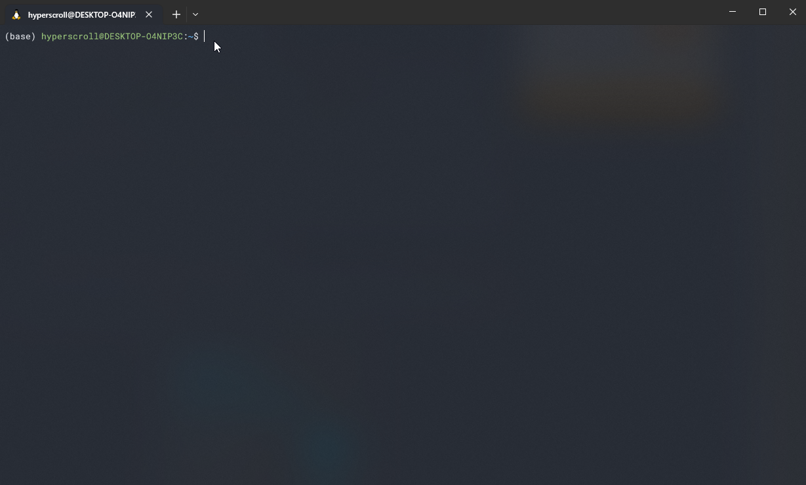
</p>

Sposób bardziej tradycyjny, z użyciem edytora tekstu wbudowanego w konsolę, będziemy omawiać w kolejnych tematach.

### Streamy, ale to nie Twitch
Pojawił nam się już parę razy znak większości i do tej pory nie powiedzieliśmy sobie, co on właściwie robi. W skrócie - mały, ale wariat. Jest to znak przekierowania (ang. redirection operator), który powoduje, że strumienie danych są przekierowywane do określonego celu. Mocne? No brzmi groźnie, a robi jeszcze więcej.

Zanim dokładnie poznamy przekierowania, trzeba wprowadzić się w strumienie danych (stream). Generalnie cały przepływ informacji w systemie Linux jest przeprowadzany na 3 strumieniach danych, które paradoksalnie też działają jak pliki:

- _stdin (ang. standard input)_ - standardowe wejście - obejmuje dane, które są wprowadzane z domyślnego źródła danych (klawiatura). Nic nie stoi na przeszkodzie, aby za stdin odpowiadał jakiś inny plik - możemy użyć tego, aby przekierować dane z pliku do jakiejś komendy. 
  <!-- Przykład z stdin pojawi się przy opisie skojarzonego z nim oznaczeniem - `<`. -->
- _stdout (ang. standard output)_ - standardowe wyjście - obejmuje dane, które są wyprowadzane na domyślny punkt końcowy (ekran/wyświetlenie w konsoli). Tymi danymi są najczęściej wszystko to, co zwraca program (wyniki działania, informacje o działaniu itd.). Tak jak w stdin, stdout może mieć inny punkt końcowy, najczęściej jest to jakiś plik, w który chcemy zamknąć wszystkie informacje, które zwrócił nam jakiś program/polecenie.
- _stderr (ang. standard error)_ - strumień ma właściwości takie jak stdout, ale z tą różnicą, że jest ekskluzywny dla wiadomości o błędach wykonywania programów/poleceń.

#### Przekierowania stdout i stderr
Za pomocą operatora przekierowań możemy manipulować strumieniami (stdout lub stderr do pliku) oraz innymi plikami (plik do innego pliku):

- `>` - ten operator jest powiązany z _stdout_; **nadpisuje wychodzące dane**. Możemy w ten sposób przekierować wynik polecenia do pliku:
    ```bash
    ls -la > ls.out
    ```
    Wynik działania polecenia `ls -la` będzie zapisany do `ls.out`

    <p align="center">
    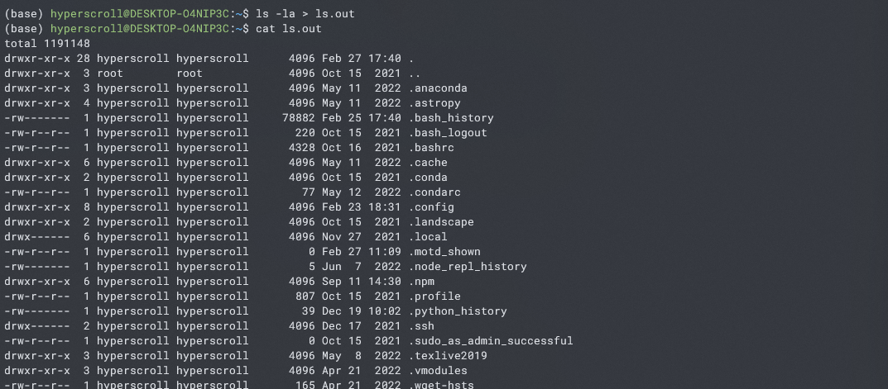
    </p>

- `>>` - ten operator jest powiązany z _stdout_; **dodaje wychodzące dane w punkcie końcowym - jeżeli przekierowanie jest do niepustego pliku, to zawartość będąca w tym pliku nie zostanie nadpisana, ale zostaną dopisane do niej nowe dane**. Dla przykładu, poprzednio utworzony plik zaktualizujmy o wykonanie neofetcha:
  ```bash
  neofetch >> ls.out
  ```
  Po wyświetleniu pliku ukaże nam się informacja od neofetcha tuż po listingu plików.

    <p align="center">
    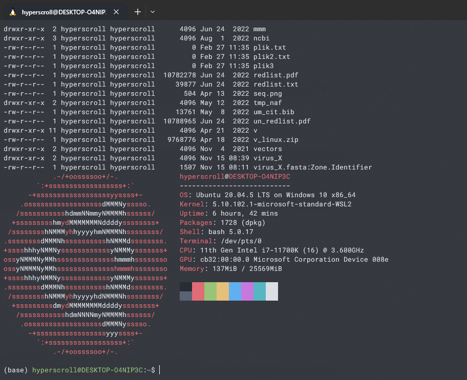
    </p>

Naturalnie, jeżeli są używane przekierowania _stdout_, to w czasie wykonywania polecenia nie pojawią się żadne informacje. Z drugiej strony, jeśli przy wykonywaniu nastąpi jakiś błąd, to informacja o błędzie będzie przekierowywana na stderr, czyli pojawi się na ekranie, a w pliku, do którego przekierowywaliśmy będzie się znajdowała zawartość, która została wyprowadzona do momentu wystąpienia błędu. Przykładowo, spróbujmy znaleźć informacje o nieistniejącym pliku (tzn. mam nadzieję, że go u ciebie nie będzie xD) i przekierujmy wynik do pliku:

```bash
ls d.txt > ls_d.out
```

<p align="center">
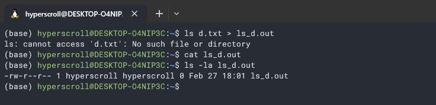
</p>

Mamy potwierdzenie, że błąd jest wypisywany, a z kolei plik istnieje, ale jest pusty.

Przekierowanie _stderr_ jest podobne, ale trzeba tutaj jeszcze zwrócić na jedną, bardziej techniczną rzecz. Każdy plik, jak i strumień ma przypisany do siebie pewien kod, przez który można się z nim komunikować - taki kod nazywa się deskryptorem pliku. Poprzednie przekierowywania również używały deskryptora pliku, ale nie specyfikowaliśmy tego wprost. Strumienie mają przypisane następujące deskryptory:

- _stdin_ - 0
- _stdout_ - 1
- _stderr_ - 2

**Zatem, jeżeli chcemy przekazać coś ze _stderr_, to musimy dopisać jego deskryptor. Numer deskryptora dopisuje się przed znakiem przekierowania.**

Kontynuując poprzedni przykład, możemy wykonać:

```bash
ls d.txt 2> ls_d.err
```

<p align="center">

</p>

Informacja o błędzie została zapisana do `ls_d.err`.

Dzięki temu, że poznaliśmy, czym są deskryptory, możemy stdout i stderr przekierowywać do osobnych plików:

```bash
ls plik.txt d 1> ls_multi.out 2> ls_multi.err
```

<p align="center">
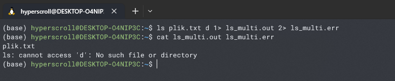
</p>

Jako ciekawostka, istnieją również operatory niestandardowe (ang. non-standard operators) `&>` i `&>>`, które pozwalają na jednoczesne przekierowanie _stdout_ i _stderr_ do tego samego pliku:

```bash
ls plik.txt d &>> ls_multi.out
```

<p align="center">

</p>

Do poprzedniej zawartości `ls_multi.out` dodaliśmy wynik i błąd.


#### Przekierowania stdin

Operator `<` jest odpowiedzialny za przekierowania wejścia. Dzięki temu możemy przerzucić na "wejście" do polecenia treść z pliku, np. zadziała to dla polecenia `cat`:

```bash
cat < ls_multi.out
```
<p align="center">

</p>

### Pliki - dominacja i manipulacja

Do tej pory omówiliśmy sobie tylko podstawowe sposoby na tworzenie plików. Teraz czas nauczyć się nimi władać - będziemy zmieniać nazwy plikom, kopiować je i usuwać oraz poznamy, tzw. uogólnianie nazw.

#### Kropki i gwiazdki - uogólnianie nazw
Przydatną funkcjonalnością w Linuxie są _wzorce uogólniające (ang. metacharacters)_, które pozwalają zastąpić część jakiejś nazwy, sprawiając, że jest ona bardziej ogólna. Definicja i suche omawianie tego jest nieintuicyjne, dlatego najlepiej jest przedstawić to na przykładzie.

Załóżmy, że mamy kilka plików, o których wiemy, że mają liczby na końcach swoich nazw, a człon nazwy przed liczbą jest zawsze taki sam (np. `plik`). Ponadto, w aktualnym katalogu jest bardzo dużo plików, a chcemy uzyskać tylko informacje o tych, które na końcach swoich nazw mają liczbę. Właśnie w takim przypadku zastosowanie mają wzorce:

```bash
ls plik* -la
```

<p align="center">
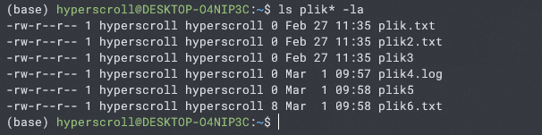
</p>

**Dopisanie `*` za członem `plik` spowoduje, że wyświetlą się informacje o wszystkich plikach, które mają człon `plik`, nie zważając na to, co się znajduje po członie `plik`. Zatem `*` oznacza dowolny znak w dowolnej ilości (0 lub więcej).**

Jeśli liczba po członie `plik` byłaby dwucyfrowa, ale chcielibyśmy informacje tylko o liczbach jednocyfrowych na końcu nazwy, to wtedy musimy użyć innego wzorca - `?`. **`?` oznacza jeden znak**. Stwórzmy przed tym jeszcze pliki z liczbami dwucyfrowymi:

```bash
touch plik11.out plik00
```
Wyszukajmy te z jednocyfrowymi liczbami:

```bash
ls plik? -la
```

<p align="center">

</p>

Coś nie pasuje, prawda? Nie pasuje i to jeszcze jak - w Linuxie "rozszerzenia" są traktowane jako integralna część nazwy, więc pokazane zostały tylko te nazwy, które po członie `plik` posiadały jeszcze jeden znak. W rezultacie, pokazane zostały pliki bez roszerzeń. Jak temu zaradzić? Trzeba użyć kolejnego wzorca, który będzie wychwytywał rozszerzenia:

```bash
ls plik?.* -la
```

<p align="center">
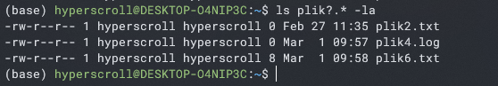
</p>

No i znowu coś nie tak. Są pliki z jednocyfrowymi liczbami i  rozszerzeniami, ale nie ma tych bez rozszerzeń. Jest na to proste wytłumaczenie. **Pomiędzy znakami `?` oraz `*` użyliśmy kropki, która dosłownie oznacza tutaj kropkę. Zatem, powiedzieliśmy wprost, że chcemy pliki, które po członie `plik` mają dowolny jeden znak (`?`), następnie posiadają kropkę, po której może znajdować się 0 lub więcej znaków (`*`).**

Co zrobić, żeby uzyskać ostateczną i poprawną wersję? Musimy użyć wielu wzorców. Tylko tyle i aż tyle ;)

```bash
ls plik? plik?.* -la
```

<p align="center">
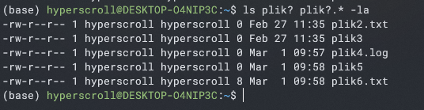
</p>

Dla ułożenia sobie wiedzy:
- `plik?` - dopasuje nazwy posiadające człon `plik` i jakikolwiek znak występujący po nim
- `plik?.*` - dopasuje nazwy posiadające człon `plik`, jakikolwiek znak występujący po nim, kropkę i 0 lub więcej znaków po kropce.

Na koniec przygody z wzorcami wyobraźmy sobie jeszcze jedną sytuację. Dzielimy komputer z kolegą, który zaśmiecił przestrzeń kolejnymi plikami. Niestety, stwierdził, że dodanie liter do członów `plik`. Jak wtedy ponownie odnaleźć pliki, których szukaliśmy poprzednio? Musimy użyć _**zakresów**_.

Najpierw wpiszmy, to co mógł zrobić kolega:

```bash
touch plika.txt plikx plikxd
ls plik? plik?.* -la
```

<p align="center">
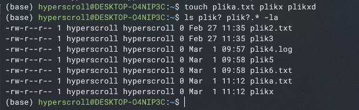
</p>

A teraz szukamy z uwzględnieniem liczb:

```bash
ls plik[0-9] plik[0-9].* -la
```

<p align="center">
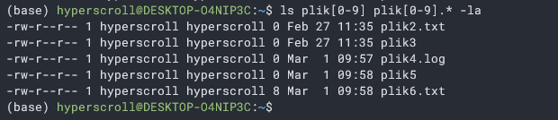
</p>

**Jak się pewnie domyślacie, `[0-9]` jest tym _zakresem_. Oznacza to tyle, że w danym miejscu jest dopasowywana jedna cyfra z przedziału 0-9. Warto pamiętać, że wskazany przedział jest obustronnie domknięty. Analogiczne działanie jest dostępne dla liter.** 

> PSA: jeżeli czujesz, że dobrze zrozumiałaś/eś powyższe zagadnienie, to jest to bardzo dobra podstawa pod inne, podobne i bardziej rozbudowane zagadnienie, jakim będą wyrażenia regularne. 

#### Kopiowanie plików
Aby skopiować plik, należy użyć komendy `cp`, którą dość intuicyjnie można kojarzyć ze słowem kopiować - _copy_.

```bash
cp <nazwa pliku kopiowanego> <docelowa nazwa kopii>
```

Kopiując plik znajduący się w aktualnym katalogu, tworzy się jego kopię w tym samym katalogu.

Jeżeli plik docelowy już istnieje wcześniej, to zostanie on automatycznie nadpisany. Można w ten sposób przypadkowo utracić poprzedni plik. Aby się od tego uchronić, można uruchomić komendę `cp` z argumentem `-i` (`--interactive`) i przy wykonaniu zostaniemy poproszeni o zatwierdzenie nadpisania pliku.

<p align="center">

</p>

Na screenie odpowiedziałem "nie" (`n`). Zgodą byłoby napisanie `y`. Przy okazji sobie pokazaliśmy, że można próbować usunąć wiele plików naraz.

#### Zmiana nazwy 
Zmiana nazwy w Linuxie działa jak "przeniesienie" starego pliku do nowego. Stąd komenda wykonująca zmianę nazwy to `mv`, która jest skrótem od _move_ (ruszyć).

```bash
mv <stara nazwa pliku> <nowa nazwa pliku>
```

Oczywiście, poprzedni plik (o starej nazwie) jest usuwany i powstaje nowy plik o nowej nazwie (mający tą samą zawartość).

Ponownie, trzeba uważać na nową nazwę pliku, bo jeśli taka nazwa już istnieje, to poprzedni plik o takiej samej nazwie, jaką chcemy teraz nadać, przestanie istnieć. Aby się przed tym uchronić, trzeba uruchamiać `mv` z argumentem `-i` i będziemy proszeni o przyznanie zgody na nadpisanie.

#### Usunięcie pliku
Usunięcie pliku jest najprostsze. Do tego celu używamy polecenia `rm`, które jest skrótem od _remove_.

```bash
rm <nazwa pliku>
```

**Oczywiście należy uważać przy takim wpisywaniu komendy, ponieważ bez pytań zostanie wyrzucony plik. Usunięcia pliku nie da się cofnąć.** Dlatego warto używać tej komendy z argumentem `-i` (`--interactive`), dzięki któremu zostaniemy zapytani o to, czy na pewno chcemy usunąć plik.

## Walka z katalogami
Już sobie wspominaliśmy o tym, że katalogi są specjalnymi plikami i to się przenosi również na to, że do manipulacji nimi będziemy używać podobnych poleceń. Czasem użyjemy jakiegoś dodatkowego argumentu, ale w końcu katalogi są specjalnym przypadkiem plików, więc nie powinno nas to dziwić.

Warto na samym początku wspomnieć o tym, że cały system katalogów w Linuxie ma strukturę drzewa, którego korzeń (początek, najniższy poziom) znajduje się w katalogu `/` i wszystkie następne katalogi są w nim zawarte (tudżież ich ścieżka wywodzi się z tego korzenia).

Do tej pory wszelkie komendy wykonywaliśmy w katalogu domowym profilu, a po systemie poruszaliśmy się tylko zwiedzając katalogi. Wraz z poznaniem katalogów będziemy w stanie oddzielać naszą pracę i utrzymamy względną czystość pośród plików.

### Ścieżki bezwzględne i względne. Łączymy kropki.
W Linuxie ścieżki mogą być zapisywane na dwa sposoby:
- ścieżka bezwzględna (absolutna) - jest zapisywana w relacji z korzeniem, czyli cała ścieżka zaczyna się w `/`. Przykładowo, bezwzględna ścieżka prowadząca do katalogu profilu jest następująca:
    ```bash
    /home/<nazwa użytkownika>
    ```
- ścieżka względna - jest zapisywana w relacji z katalogiem roboczym (w którym się znajdujemy obecnie)

Aby sobie dobrze zobrazować różnicę, porównajmy oba rodzaje ścieżek do pliku systemowego `passwd`. 

Ścieżka bezwzględna wygląda następująco:
```bash
/etc/passwd
```

Ścieżka względna z katalogu użytkownika wygląda tak:
```bash
../../etc/passwd
```

Stosowne jest teraz pytanie "czym są te kropki?"

`..` to jeden z dwóch wyjątkowych "katalogów", które są obecne w każdym katalogu. Drugi taki "katalog" to `.`. 

`..` wskazuje na bezpośrednio niższy katalog w hierarchii. Zatem, jeśli chcemy wskazać w ścieżce katalog wstecz, to zapisujemy `..`:
```bash
cd ..
```

`.` oznacza aktualny katalog, w którym się znajdujemy (katalog roboczy). Najczęściej jest on używany jeżeli gdzieś chcemy odwołać się do aktualnego katalogu. Takie odwołanie pojawi się przy okazji kopiowania.

<!-- ### Praca z katalogami -->

### Tworzenie katalogów
Do stworzenia katalogu istnieje dedykowane polecenie `mkdir`, które jest skrótem od _make directory_. Dzięki temu, łatwo tę komendę zapamiętać. Stwórzmy pierwszy katalog:

```bash
mkdir dir1
```

W łatwy sposób można utworzyć kilka katalogów naraz:

```bash
mkdir dir2 dir3 dir4
```

Możliwe jest również stworzenie nowego katalogu w już istniejącym, bez przechodzenia do niego:

```bash
mkdir dir1/subdir1
```

Naturalnie, jeśli chcemy utworzyć podkatalog w nieistniejącym katalogu, to zostaniemy uraczeni błędem:

```bash
mkdir dir5/subdir1
```

<p align="center">
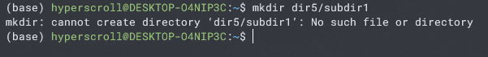
</p>

Aby temu zaradzić, musimy użyć argumentu `-p`, który będzie tworzył katalogi rodzicielskie (ang. parent directory) dla podkatalogów:

```bash
mkdir -p dir5/subdir1/subsubdir1
```

<p align="center">
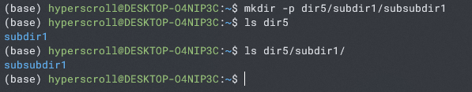
</p>

### Kopiowanie katalogów (i do katalogów)
Kopiowanie plików do katalogów jest analogiczne do kopiowania samych plików:

```bash
cp plik2.txt dir5/subdir1
```

<p align="center">
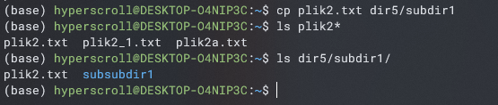
</p>

Oczywiście, możliwe jest kopiowanie wielu plików...

```bash
cp plik2.txt plika.txt dir5/subdir1/subsubdir1/
```

... które można sobie usprawnić poprzez wzorce:

```bash
cp plik?.* dir5/subdir1/subsubdir1/
```

<p align="center">
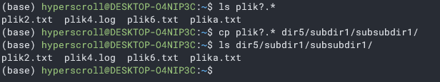
</p>

Ironicznie, przekopiowanie całej zawartości katalogu nie jest takie oczywiste. Żeby to zobaczyć, skopiujmy jakiś plik do `dir5` i spróbujmy skopiować `dir5` do `dir2`:

```bash
cp plik6.txt dir5
cp dir5/* dir2
```

Powyższa komenda wydaje się logiczna - * oznacza jakikolwiek ciąg znaków, więc weźmie cokolwiek znajdującego się w katalogu `dir5`... tylko, że nie. Wpisywany w ten sposób wzorzec jedynie odnosi się do zwykłych plików, zatem pominięte zostaną znajdujące się w `dir5` katalogi. Na szczęście, rozwiązanie zostaje nam podane na tacy:

<p align="center">
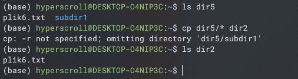
</p>

Grzecznie wpiszmy argument `-r`, tak jak Linux podpowiada:

```bash
cp -r dir5/* dir2
```

<p align="center">
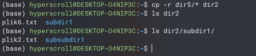
</p>

Teraz widać, że została przekopiowana _rekurencyjnie_ cała zawartość katalogu `dir5` do `dir2`. Przenisienie jest rekurencyjne, ponieważ zagłębiamy się podkatalogi wszystkich katalogów, a następnie w podkatalogi podkatalogów, itd. Sam argument `-r`  pochodzi od `--recursive`, co oznacza _rekurencyjnie_.

Tak samo, jak w przypadku plików, przy kopiowaniu katalogów i ich zawartości może się zdarzyć nieporządane nadpisanie. Jeżeli chcemy uniknąc przypadkowych wywołań z tego powodu, stosujemy `-i`, dzięki czemu będziemy zapytani o pozwolenie. Istnieje jeszcze argument `-u`, który sprawi, że nie będą kopiowane pliki i katalogi, które już istnieją w katalogu docelowym. Ma to duże znaczenie przy kopiowaniu wielu plików, ponieważ można znacznie skrócić czas takiej operacji. Podsumowując - prawdopodobnie najlepszym i najbezpieczniejszym sposobem wywoływania polecenia kopiowania jest:
```bash
cp -iu <obiekt kopiowany> <miejsce docelowe>
```

### Zmiana nazwy katalogu
Zmiana nazwy działa tak samo, jak w przypadku plików:

```bash
mv dir1 dir11
```

`mv` służy również do przeniesienia plików do katalogów:

```bash
mv plik.txt dir11
```

<p align="center">

</p>

Tak samo jak w przypadku plików, przy zmianie nazwy tracimy oryginalny katalog i zostaje stworzona kopia o innej nazwie. Aby przez przypadek nie wykonać tej operacji, można wywołać `mv` z argumentem `-i` - będziemy zapytani o pozwolenie.

Jeszcze jednym argumentem, całkiem przydatnym, jest `-u` (`--update`), który 
podczas przenoszenia plików z jednego katalogu do drugiego kopiuje tylko te pliki, które nie istnieją w katalogu docelowym lub są nowsze niż pliki znajdujące się w katalogu docelowym. Dzięki temu możemy uniknąć nieporządanych nadpisań plików.

### Usuwanie katalogów
Występuje tutaj ten sam plottwist, co w przypadku kopiowania całych zawartości katalogów - musimy używać argumentu `-r`:

```bash
rm -r dir2
```

## Ból braku interfejsu graficznego - co robić, żeby się nie przegrzać
Nie ukrywajmy, zarządzanie plikami i katalogami z poziomu konsoli może być lekko niewygodne. Można sobie z tym ulżyć, wykorzystując parę sztuczek wewnątrz konsoli lub wykorzystując wszelkie możliwości wynikające z używania WSL.

Ewentualnie, możesz wykorzystać WSLg, aby praktycznie zreplikować graficzne doświadczenia z Linuxa. Jednak nie jest to zawsze możliwe, a chcemy sie nauczyć jak najbardziej uniwersalnej obsługi Linuxa, szczególnie z poziomu temrinala.

### Linki
Czasem nie opłaca się kopiować pewnych plików, albo dostęp do nich jest utrudniony, ponieważ mogą znajdować się w innym systemie plików. Aby temu zaradzić, można wykorzystać _linki (dowiązania)_.

Linki są swego rodzaju skrótami do plików lub katalogów, które są znane z Windowsa. Nie do końca tak samo działają, ale nie jest to zły sposób myślenia o nich.

Są dwa rodzaje linków:
- linki twarde - ten link jest najbardziej różniący się od skrótów z Windowsa. Jest on bezpośrednim odniesieniem do pliku w **systemie plików Linuxa**. Gdy się go tworzy, to w zasadzie tworzony jest duplikat oryginalnego pliku, w którym zmiany są odzwierciedlane w pliku oryginalnym, a zmiany w pliku oryginalnym są odzwierciedlane w linku. Twardy link jest przydatny wtedy, gdy pracuje na nim wiele osób w jednym czasie, przez co można uniknąć kopiowania do wielu miejsc, a zmiany dokonywane na tym pliku są automatycznie widoczne u każdej osoby, która z niego korzysta (czy to przez link, czy przez plik oryginalny).
  
  Twarde linki tworzy się następująco:

  ```bash
  ln -f <plik oryginalny> <nazwa linku>
  ```

  **Zauważ, że twarde linki można tworzyć tylko dla plików, a nie dla katalogów.**

- linki symboliczne - specjalny plik, który jest wskaźnikiem do innego pliku albo katalogu. Jest on podobny do skrótu z Windowsa. W przeciwieństwie do linków twardych, linki symboliczne nie duplikują oryginalnego pliku lub katalogu. Zamiast tego tworzą nowy plik, który odwołuje się do oryginalnego pliku lub katalogu przez jego ścieżkę. Linki symboliczne są przydatne, gdy chcemy stworzyć skrót do pliku lub katalogu, który znajduje się w innym katalogu lub w innym systemie plików. Najprostszy przykład zastosowania to zalinkowanie folderu z dużą ilością plików z Windowsa do docelowego katalogu w Linuxie. Szczególnie jest to przydatne, gdy nad plikami pracuje się np. w Windowsie, ale obliczenia na nich wykonuje się w Linuxie.

  Symboliczne linki tworzy się następująco:
  
  ```bash
  ln -s <obiekt oryginalny> <nazwa linku>
  ```

  Przykładowy link do katalogu `dir1_1` (powinien być po rzetelnym przerobieniu wszystkich treści do tej pory ;)), który będzie znajdował się w najbardziej zagnieżdżonym katalogu `dir5`:

  ```bash
  cd dir5/subdir1/subsubdir1/
  ln -s ../../../dir1_1 dir1_1_link
  ```

  <p align="center">
  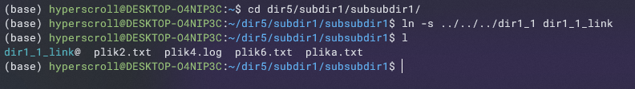
  </p>

  Od teraz będąc w `dir5/subdir1/subsubdir1/` można dowolnie wykorzystywać zawartość `dir1_1` bezpośrednio (bez podawania całej ścieżki).

### Wizualizacja
Korzystając z Linuxa w konsoli,łatwo się zgubić w hierachii plików. Szczególnie jest ciężko, gdy musimy coś przenieść z jednego miejsca na drugie i dosłownie musimy sobie wyobrazić całą drogę w hierarchii od startu do miejsca docelowego. Aby mniej nad tym myśleć, warto zainstalować sobie paczkę `tree`, która może zwizualizować drzewo plików z miejsca, w którym się aktualnie znajdujemy.

Zainstalujmy paczkę:

```bash
sudo apt install tree
```

Przejdź do katalogu `dir5` i wpisz w nim:

```bash
tree
```

<p align="center">
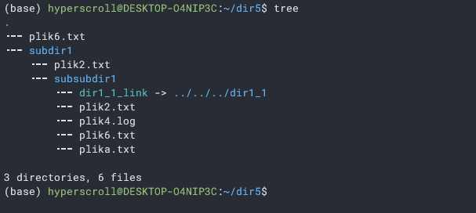
</p>

Wyświetlone zostaje całe drzewo plików i katalogów począwszy od `dir5`, który jest reprezentowany tutaj jako `.`, czyli jako aktualny katalog roboczy. Każde wcięcie oznacza tutaj kolejny katalog, zatem jeżeli nie wiemy ile "cofnięć" (czyli znaków poprzedniego katalogu `..`) musimy wpisać w ścieżkę, to komenda `tree` nam doskonale to pokazuje. Ponadto pokazuje ścieżkę, do której wskazują linki oraz wypisywane jest krótkie, liczbowe podsumowanie zawartości w badanym katalogu.

### Wykorzystanie WSL
Opisywaliśmy wiele zalet WSL w temacie 1 i należy z nich korzystać. Przede wszystkim trzeba korzystać z tego, jak bardzo płynna jest integracja funckji Linuxa z Windowsa - możemy włączać (niektóre) programy Windowsa z poziomu Linuxa i na odwrót. 

Już o tym wspominaliśmy przy temacie 1, ale warto sobie to jeszcze przypomnieć - najbardziej wygodną funkcją jest włączanie Eksploratora Windowsa z poziomu Linuxa. Dzięki temu, w każdym momencie można graficznie, w Windowsie, zwizualizować sobie katalog z Linuxa. Naturalnie, są wtedy dostępne wszystkie akcje Windowsa - można kopiować, przenosić i zmieniać nazwy elementów, ale również można tworzyć katalogi i pliki. 

```bash
explorer.exe .
```

<p align="center">
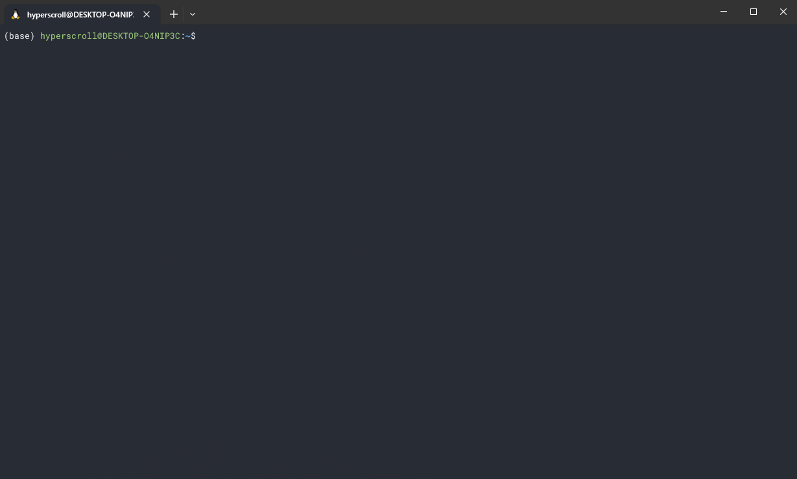
</p>

Z poziomu Linuxa możemy włączać programy Windowsa. Przykładowo, jeżeli nam się bardzo nie podobają edytory tekstu wewnątrz konsoli Linuxa, to możemy włączyć plik w popularnym _Notatniku_:

```bash
notepad.exe dir5/plik6.txt
```

<p align="center">

</p>

Powyższe działanie jest prawdopodobnie lepsze niż otwieranie plików w konsoli. Zależy to od naszych potrzeb, ale z doświadczenia (mojego) najprościej jest wszystko otwierać w ulubionym edytorze tekstu. A WSL daje taką możliwość.

Jedynym ograniczeniem zarządzania plikami i katalogami z poziomu Eksploratora Windowsa jest to, że nie da się wykonywać zadań na elementach, które nie występują naturalnie w danych systemach plików. Przykładowo, z poziomu Eksploratora Windowsa nie da się całkowicie skopiować katalogu, który posiada link - nie zostanie on skopiowany. Z drugiej strony, stworzenie skrótu Windowsa będzie wykonane, natomiast będzie to plik nierozpoznawalny przez Linuxa.

Mimo wszystko zdarza się, że lepiej jest wykonać operację w konsoli Linuxa, ale potrzebne do tego są pliki z systemu plików Windowsa. Mamy wtedy do wyboru 2 opcje:

- utworzenie linku symbolicznego do lokalizacji w Windowsie.
- bezpośrednie operacje poprzez montowanie dysku z Windowsa. Dostęp do zamontowanych dysków jest uzyskiwany poprzez katalog `mnt`. Ścieżka do elementów z systemu plików Windowsa musi się zaczynać zawsze od `mnt`, a następnie elementy w ścieżce są takie same jak w Windows, zaczynając od liter przypisanych do windowsowych partycji twojego dysku. Dla przykładu, dostań się do dokumentów twojego profilu w Windowsie z poziomu Linuxa:
    
    ```bash
    ls -la /mnt/c/Users/<twoja nazwa użytkownika>/Documents/
    ```

    <p align="center">
    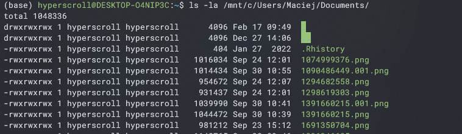
    </p>

## Twoja kolej - zadanie
> sa niedociagniecia jeszcze, np. pokazac wielkosc pliku nowego; sprawdzic jeszcze to

Przećwiczymy sobie większość poleceń wprowadzonych w tym temacie oraz przypomnimy parę z poprzednich tematów.

Zostałaś/eś poproszony o pobranie sekwencji 10, 11 i 12 chromosomu z genomu Gallus gallus z bazy NCBI. Potrzebny jest jeden plik, który będzie zawierał wszystkie te chromosomy. Docelowy plik `.fna` ma być umieszczony w katalogu `gallus_chr`, w którym znajdzie się również katalog zawierający oryginalne pliki z rozszerzeniem `.fasta`. Dodatkowo, wymagany jest raport z potwierdzeniem, że pliki zostały umieszczone w odpowiednim miejscu. Raport ma być zapisany w katalogu profilowym pod nazwą `gallus_raport.txt`

> **Note**
> Po wykonanym zadaniu sprawdź zawsze _Proponowane rozwiązanie_. Porównasz i sprawdzisz czy zrobiłeś/aś wszystko dobrze, a także możesz się zastanowić nad zaawansowanymi pytaniami (dla odważnych). Miłej roboty!

> **Wskazówki**
> 
><details>
><summary></summary>
>
>  - Pobranie sekwencji chromosomów można
> pobrać ręcznie, z przeglądarki. Pod 
> adresem
  https://www.ncbi.nlm.nih.gov/genome/111?genome_assembly_id=1543395 znajduje się lista chromosomów. Po wejściu w rekord chromosomu, należy wyświetlić rekord jako FASTA i używając opcji _Send to_ przesłać rekord do pliku (_Choose destination: File_). Tak uzyskane pliki trzeba przenieść do systemu plików Linuxa.
>  - Sposób złączenia plików jest dowolny
> ale spróbuj go wykonać poprzez polecenie
> Linuxa. Jest on najszybszy i najmniej
> pracochłonny.
>  - Operacje na plikach też staraj się 
> wykonać poprzez polecenia Linuxa.
>  - Raportem będącym potwierdzeniem 
> wykonania zadania może być wynik 
> działania poleceia `ls` lub `tree`.
>
</details>


> **Proponowane rozwiązanie**
> 
><details>
><summary></summary>
>
> 1. Stworzenie katalogu `gallus_chr` i przeniesienie tam plików `.fasta`. Pobrane pliki można nazwać gallus_chr10.fasta itd.
> 
>   ```bash
>   mkdir gallus_chr
>   explorer.exe .
>   ```
> 2. Przejście do katalogu `gallus_chr`:
> 
>   ```bash
>   cd gallus_chr
>   ```
> 3. Złączenie plików `.fasta`:
>
>   ```bash
>   cat gallus_chr1?.fasta > gallus_10-12.fna
>   ``` 
> 4. Stworzenie katalogu na oryginalne pliki:
>   ```bash
>   mkdir gallus_src
>   ```
>
> 5. Przeniesienie oryginalnych plików do katalogu `gallus_src`:
>   ```bash
>   mv gallus_chr1?.fasta gallus_src/
>   ```
> 6. Wygenerowanie raportu:
>   ```bash
>   tree > ../gallus_raport.txt
>   less ../gallus_raport.txt
>   ```
>   <p align="center">
>    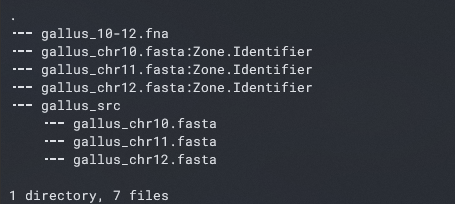</p>
>
> **Pytania dla odważnych:**
>
> - Czy widzisz szanse na zmniejszenie ilości kroków i uproszczenie?
> - Jak wykonać to zadanie bez korzystania z przenoszenia plików za pomocą interfejsu graficznego (czyli bez `explorer.exe`)?
</details>

---

| [Poprzedni Temat](https://github.com/BioSoft23/The_Curse_of_Linux/tree/main/Temat_02) | [Strona główna](https://github.com/BioSoft23/The_Curse_of_Linux) | [Następny Temat](https://www.youtube.com/watch?v=dQw4w9WgXcQ) |
| :---------------------------------------------------------------: | :-------------------------------------------------------------: | :--------------------------------------------------------------- |
